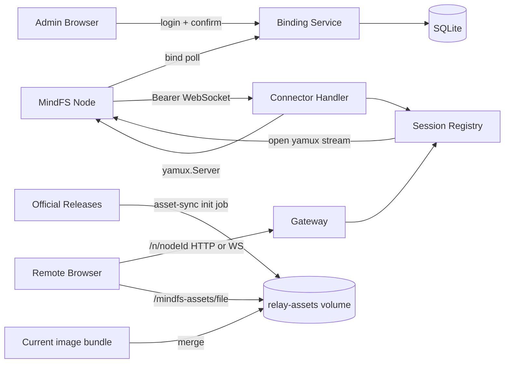

# Cloud Relay 核心架构

## 0. 术语

- **MindFS Node**：现有 `server` 进程及其 Relay 客户端。它主动连接 Cloud Relay，现有源码保持只读。
- **Cloud Relay**：`cloud/` 独立 Go module 运行的后端进程，拥有绑定控制面和公网转发数据面。
- **Binding Challenge**：Node 生成 code 后由 Cloud Relay 首次观察、管理员确认的一次绑定状态。
- **Device Token**：Node 建立 Connector 时使用的 Bearer 凭据；明文只在 confirmed 响应中出现。
- **Connector**：Node 主动建立的长期 WebSocket，内部承载 yamux 字节流。
- **Relay Session**：Cloud Relay 为一个在线 Node 持有的 `yamux.Server` session。
- **Gateway Stream**：一次公网 HTTP 或 WebSocket 请求对应的一条 yamux stream。
- **Public Node Route**：公网侧 `/n/{nodeId}/...` 路径；进入 Node 前会去掉节点前缀。
- **Multi-release Asset Repository**：持久化保存当前 bundle 与所有受支持官方 release Web assets 的全局资源集合；content-hashed 文件只增不删。

这些名词在代码中的类型入口为 `cloud/internal/store/contracts.go:18`、`cloud/internal/connector/registry.go:18` 和 `cloud/internal/gateway/http.go:122`。

## 1. 定位与受众

Cloud Relay 是仓库中与现有 MindFS 上游隔离的兼容后端。它只依赖现有客户端已经公开的 HTTP、WebSocket、yamux 和 frame 行为，不 import `server/internal/relay`。入口装配位于 `cloud/app/app.go:34`，独立进程入口位于 `cloud/cmd/mindfs-relay/main.go:16`。

本文供后续 feature design、问题定位和部署开发使用。读完后应能确定绑定状态写在哪里、在线连接由谁持有，以及公网请求如何到达 Node。

## 2. 结构与交互



- `app.New` 先打开 SQLite、清理过期记录，再装配 Binding、Connector、Gateway 和 Session Registry；数据库不可用时启动失败。代码锚点：`cloud/app/app.go:34`。
- Binding 首次 poll 原子创建 challenge；管理员确认在同一 SQLite 事务中创建 Node、Token hash 并确认 challenge；同一 code/device 后续重新派生相同 Token。代码锚点：`cloud/internal/binding/service.go:71`、`cloud/internal/store/sqlite.go:124`。
- Connector 在 WebSocket 升级前验证 Bearer Token，升级后用严格 binary WebSocket `net.Conn` 创建 `yamux.Server`。代码锚点：`cloud/internal/connector/handler.go:41`、`cloud/internal/connector/wsconn.go:25`。
- Session Registry 以 node ID 保存唯一 active session；替换时先登记新 connection ID，再关闭旧 session，旧连接的延迟清理不会删除新连接。代码锚点：`cloud/internal/connector/registry.go:43`。
- HTTP Gateway 先查 Node 和在线 session，打开 stream，去掉 `/n/{nodeId}`，重建内部 Header，再流式转发 request/response。代码锚点：`cloud/internal/gateway/http.go:44`。
- WebSocket Gateway 先把 Upgrade request 发给 Node；只有 Node 返回 101 才升级公网侧，随后在 WebSocket message 与 MindFS data/close frame 间双向桥接。代码锚点：`cloud/internal/gateway/websocket.go:35`。
- Gateway 为 Node 生成 `X-MindFS-Relayed: 1`；该值是未修改 Node 进入 release 静态资源重写分支的严格协议契约。代码锚点：`cloud/internal/gateway/http.go:156`。

路由表集中在 `cloud/app/app.go`，除 Binding、Connector 和 Public Node Route 外，还挂载 `/healthz`、`/readyz`、`/metrics` 和 `/mindfs-assets/`。Relay 从只读挂载的持久化多 release repository 提供共享 assets；成功响应使用一年 immutable 缓存，缺失或非法路径明确返回 `Cache-Control: no-store`。

## 3. 数据与状态

SQLite 只拥有四类控制面数据：

- `admin_sessions`：管理员 Session hash、CSRF hash 和有效期。
- `bind_challenges`：code hash、设备归属、状态、node ID、派生版本和有效期。
- `nodes`：Node 身份、名称、状态、访问模式和最近在线时间。
- `device_tokens`：Token hash、Node 归属、状态和使用时间。

Schema 位于 `cloud/internal/store/schema.sql:1`，对应值对象和 Store 契约位于 `cloud/internal/store/contracts.go:18`。确认事务位于 `cloud/internal/store/sqlite.go:124`，数据库不保存 Device Token 明文、Token Key、管理员密码或业务 payload。

在线连接不写数据库。`Registry` 只在当前进程内保存 `node ID -> connection ID + RelaySession`，进程重启后为空，Node 使用已持久化 Token 自动重连。代码锚点：`cloud/internal/connector/registry.go:38`。

## 4. 关键决策

- Cloud Relay 只写 `cloud/**`，现有 MindFS 代码永久只读。来源：`relay-core-single-instance-design.md` 第 1 节和用户确认。
- 控制面使用 SQLite，在线 session 使用内存。来源：`relay-core-single-instance-design.md` 关键决策 3。
- Device Token 使用独立 Token Key 做确定性 HMAC 派生，持久层只存 SHA-256 hash。来源：`mindfs-cloud-relay-roadmap.md` 第 4.1 节和已批准方案 1。
- 每个 Node 只有一个 active Relay Session，新连接优先。来源：`relay-core-single-instance-design.md` 流程级约束。
- Gateway 不解析或解密 E2EE Header、body 和 WebSocket payload。来源：`relay-core-single-instance-design.md` 第 1、2.2 节。
- `/mindfs-assets/` 保持未修改客户端既有的全局路径。Cloud 通过持久 volume 合并当前镜像 bundle 与 `v0.1.8` 起的官方 release assets，hashed 文件只增不删且同名不同内容立即失败。来源：官方多版本 HTTP 响应与 `relay-node-assets-unavailable-analysis.md`。

## 5. 代码锚点

- `cloud/cmd/mindfs-relay/main.go:main` — 配置加载、HTTP Server 和优雅关闭。
- `cloud/app/app.go:New` — SQLite、服务、Registry 与路由装配。
- `cloud/internal/config/config.go:Load` — 七个 V0 环境配置键、Asset Bundle 校验及默认时限。
- `cloud/internal/binding/service.go:Service` — challenge 状态机和绑定确认编排。
- `cloud/internal/binding/token.go:DeviceTokenService` — HMAC 派生与 Token hash 鉴权。
- `cloud/internal/connector/handler.go:Handler` — Connector 鉴权、WebSocket 和 `yamux.Server`。
- `cloud/internal/connector/registry.go:SessionRegistry` — active session 注册、替换和 stream 打开。
- `cloud/internal/gateway/http.go:Handler` — Public Node Route 与 HTTP 反向转发。
- `cloud/internal/gateway/websocket.go:ServeWebSocket` — 101 协调与 data/close frame 桥接。
- `cloud/internal/assetsync/service.go:Sync` — 当前 bundle 合并、官方 release 分页发现、archive 校验、安全提取和完整性 marker。
- `cloud/internal/store/sqlite.go:SQLiteStore` — V0 SQLite repository。
- `cloud/internal/store/backup.go:BackupSQLite` — 在线 SQLite 快照、目标守护和 integrity check。
- `cloud/internal/ops/` — migrate、backup、healthcheck 与低敏 Prometheus metrics。
- `cloud/Dockerfile`、`cloud/deploy/` — Web + Cloud 多阶段镜像、Compose、Caddy 和运维说明。

## 6. 黑盒兼容验证

`cloud/compat/` 从 Cloud 侧构建并启动真实 `mindfs-relay` 与未修改 `cli/cmd`，使用真实 TCP、SQLite、磁盘凭据、Connector WebSocket 和 yamux 验证完整链路。默认测试只编译并 skip 重型场景；显式命令为：

```bash
cd cloud
MINDFS_RUN_COMPAT=1 go test ./compat -run TestUnmodifiedNodeRelayCompatibility -v
```

设置 `MINDFS_COMPAT_NODE_BINARY=/path/to/mindfs` 可跳过当前 checkout 的 Node 构建，对一个预构建客户端执行同一场景。场景覆盖绑定确认、Public Route HTTP、release 静态路径重写、独立 E2EE open/proof/HKDF/AES-GCM、加密 WebSocket ping/pong，以及 Cloud 进程重启后的 Node 自动重连。

测试侧 E2EE 实现位于 `cloud/compat/e2ee_test.go`，只实现公开协议，不 import 或链接 `server/internal/e2ee`。Process Harness 位于 `cloud/compat/process_test.go` 和 `cloud/compat/scenario_test.go`，为每次 run 分配独立 HOME、DataDir、Node root、static fixture 和 loopback 端口；子进程使用最小环境、收紧 PATH 和无效外网代理，不继承宿主 API 凭证。失败日志会清洗 bind code、pairing secret、Token、Authorization、proof 和 ciphertext。

兼容套件在真实客户端链路中发现并回归了 `X-MindFS-Relayed` 值不兼容问题，修复记录为 `.codestable/issues/2026-08-03-relayed-header-value/relayed-header-value-fix-note.md`。

## 7. 部署与运维

`mindfs-relay` 无参数或 `serve` 启动服务，并提供以下 Ops Command：

```text
mindfs-relay validate
mindfs-relay migrate
mindfs-relay backup /path/to/new-backup.db
mindfs-relay healthcheck
mindfs-relay sync-assets /opt/mindfs/web /var/lib/mindfs-assets
```

`validate` 只输出非敏感结果；`migrate` 幂等执行 embedded schema；`backup` 使用 SQLite `VACUUM INTO` 生成不覆盖已有文件的 `0600` 一致性快照并执行 `PRAGMA integrity_check`；`healthcheck` 只访问本机 `/readyz` 且不打印响应 body；`sync-assets` 合并当前 bundle 和官方正式 release，不删除已有历史资源。

`/healthz` 仅代表进程存活，`/readyz` 每次检查 SQLite、`index.html`、`assets/` 目录及 index 实际引用的本地 JS/CSS，`/metrics` 只按 method/status 聚合 request count 与 duration。`MINDFS_CLOUD_ASSETS_DIR` 指向合并后的 repository；Cloud 的 `/mindfs-assets/{path}` 用受限文件根读取普通文件并拒绝遍历、目录和越界 symlink。

容器从仓库根以独立 stage 构建现有 `web/` 和 `cloud/`，最终使用 distroless non-root 用户。Compose 的一次性 `asset-sync` 服务读写 `relay-assets` volume，成功完成后 Relay 才启动并以只读方式挂载该 volume；SQLite data 与 backup 使用独立 volume。Caddy 在 Cloud 外终止 TLS/WSS；示例位于 `cloud/deploy/`。

## 8. 已知约束 / 边界情况

- 这是单进程实现，但支持多个 Node；不支持多实例共享 presence。
- TLS 可以在外部终止；Connector endpoint 的 `ws/wss` 只由可信 `MINDFS_CLOUD_PUBLIC_URL` 决定。
- 管理员是单个 bootstrap 账号；没有节点管理、Token 轮换、多用户或 OIDC API。
- 不包含 Token Station、本地服务域名、托管内容、版本下载、PostgreSQL、Redis、Docker 或生产反代模板。
- 单条 WebSocket message 上限固定为 32 MiB；未知 frame 或非法 opcode 以 1002 关闭，超限以 1009 关闭。
- 上游协议变化时只修改 `cloud/**` 适配，不修改现有 MindFS Node、Web、CLI 或移动端。
- 首次 `asset-sync` 依赖 GitHub Releases 可用并需要约 111 MiB 持久磁盘；后续同步幂等，只追加新 release 或修复缺失的 hashed 文件。
- 当前只提供 Docker Compose + Caddy 示例，不包含 Kubernetes、Helm、systemd、自动备份调度、远端存储或灾备恢复编排。

## 9. 相关文档

- Requirement：`requirements/mindfs-compatible-cloud-backend.md`
- Roadmap：`roadmap/mindfs-cloud-relay/mindfs-cloud-relay-roadmap.md`
- Feature design：`features/2026-08-03-relay-core-single-instance/relay-core-single-instance-design.md`
- Feature acceptance：`features/2026-08-03-relay-core-single-instance/relay-core-single-instance-acceptance.md`
- Compatibility design：`features/2026-08-03-relay-compatibility-suite/relay-compatibility-suite-design.md`
- Compatibility acceptance：`features/2026-08-03-relay-compatibility-suite/relay-compatibility-suite-acceptance.md`
- Deployment design：`features/2026-08-03-relay-deployment-baseline/relay-deployment-baseline-design.md`
- Deployment acceptance：`features/2026-08-03-relay-deployment-baseline/relay-deployment-baseline-acceptance.md`
