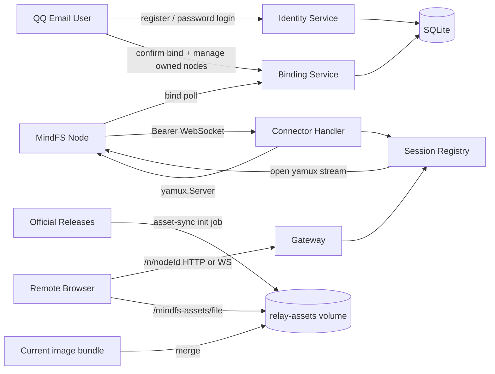

# Cloud Relay 核心架构

## 0. 术语

- **MindFS Node**：现有 `server` 进程及其 Relay 客户端。它主动连接 Cloud Relay，现有源码保持只读。
- **Cloud Relay**：`cloud/` 独立 Go module 运行的后端进程，拥有绑定控制面和公网转发数据面。
- **Cloud User**：以唯一规范化 `@qq.com` 邮箱标识的 Relay 用户；注册时设置 Relay 密码，日常使用邮箱和该密码登录。
- **Cloud Session**：注册或邮箱密码登录后建立的 12 小时浏览器会话；Cookie 保存随机 Token，SQLite 只保存 hash。
- **Node Owner**：确认绑定时的当前 Cloud User；节点列表、重命名和删除按 owner 隔离。
- **Bootstrap User**：V0 升级时承接既有节点的 pending QQ 账号；该邮箱完成验证码注册后激活并认领原节点。
- **Binding Challenge**：Node 生成 code 后由 Cloud Relay 首次观察、当前 Cloud User 确认的一次绑定状态。
- **Device Token**：Node 建立 Connector 时使用的 Bearer 凭据；明文只在 confirmed 响应中出现。
- **Connector**：Node 主动建立的长期 WebSocket，内部承载 yamux 字节流。
- **Relay Session**：Cloud Relay 为一个在线 Node 持有的 `yamux.Server` session。
- **Gateway Stream**：一次公网 HTTP 或 WebSocket 请求对应的一条 yamux stream。
- **Public Node Route**：公网侧 `/n/{nodeId}/...` 路径；进入 Node 前会去掉节点前缀。
- **Multi-release Asset Repository**：持久化保存当前 bundle 与所有受支持官方 release Web assets 的全局资源集合；content-hashed 文件只增不删。

这些名词在代码中的类型入口为 `cloud/internal/store/contracts.go`、`cloud/internal/identity/service.go`、`cloud/internal/connector/registry.go` 和 `cloud/internal/gateway/http.go`。

## 1. 定位与受众

Cloud Relay 是仓库中与现有 MindFS 上游隔离的兼容后端。它只依赖现有客户端已经公开的 HTTP、WebSocket、yamux 和 frame 行为，不 import `server/internal/relay`。入口装配位于 `cloud/app/app.go:34`，独立进程入口位于 `cloud/cmd/mindfs-relay/main.go:16`。

本文供后续 feature design、问题定位和部署开发使用。读完后应能确定绑定状态写在哪里、在线连接由谁持有，以及公网请求如何到达 Node。

## 2. 结构与交互



- `app.New` 先打开 SQLite、幂等补齐 identity/owner schema、把 V0 ownerless 节点归给 bootstrap QQ 用户，再加载或创建 `identity.key`，装配 Identity、Binding、Connector、Gateway 和 Session Registry；数据库或身份配置不可用时启动失败。代码锚点：`cloud/app/app.go:43`、`cloud/internal/store/sqlite.go:24`。
- Identity Service 负责 QQ 邮箱准入、注册/重置验证码、Argon2id 密码、登录限流和 UserSession；注册、验证码消费与 Session 创建使用同一事务。代码锚点：`cloud/internal/identity/service.go`、`cloud/internal/store/sqlite_identity.go`。
- Binding 首次 poll 原子创建 challenge；当前 Cloud User 确认时在同一 SQLite 事务中写入 challenge claimant、Node owner、Token hash；同一用户对 confirmed code 重试保持幂等，其他用户得到 claimed。代码锚点：`cloud/internal/binding/service.go`、`cloud/internal/store/sqlite_binding.go`。
- Connector 在 WebSocket 升级前验证 Bearer Token，升级后用严格 binary WebSocket `net.Conn` 创建 `yamux.Server`。代码锚点：`cloud/internal/connector/handler.go:41`、`cloud/internal/connector/wsconn.go:25`。
- Session Registry 以 node ID 保存唯一 active session；替换时先登记新 connection ID，再关闭旧 session，旧连接的延迟清理不会删除新连接。代码锚点：`cloud/internal/connector/registry.go:43`。
- HTTP Gateway 先查 Node 和在线 session，打开 stream，从 EscapedPath 去掉 `/n/{nodeId}`，保留转发 URL 的 decoded Path 与原始 RawPath，重建内部 Header，再流式转发 request/response；WS 握手复用同一路径处理。代码锚点：`cloud/internal/gateway/http.go:Handler`。
- WebSocket Gateway 先把 Upgrade request 发给 Node；只有 Node 返回 101 才升级公网侧，随后在 WebSocket message 与 MindFS data/close frame 间双向桥接。代码锚点：`cloud/internal/gateway/websocket.go:35`。
- Gateway 为 Node 生成 `X-MindFS-Relayed: 1`；该值是未修改 Node 进入 release 静态资源重写分支的严格协议契约。代码锚点：`cloud/internal/gateway/http.go:156`。
- Relay 浏览器控制台（`/nodes`）受 Cloud Session 保护：未登录跳 `/login?next=`；`/login` 提供登录、注册和忘记密码三种模式。登录后 `GET /api/nodes` 只读取当前 owner 的 SQLite 节点并合并 Registry 在线状态，按 online→最近在线→创建时间→ID 确定性排序；rename/delete 同时校验 owner 和同源 Origin。越权统一 `node_not_found`，成功删除才撤销 Device Token 并关闭 active session。代码锚点：`cloud/app/identity_handlers.go`、`cloud/app/relay_browser_handlers.go`、`cloud/app/relay_nodes_handlers.go`。

路由表集中在 `cloud/app/app.go`。身份入口包括 register request-code/register、email/password login、password reset/change、me/logout；控制面保留 `/bind`、`GET/PATCH/DELETE /api/nodes`，数据面保留 Connector 与 `/n/{nodeId}`。Relay 从只读挂载的持久化多 release repository 提供共享 assets；成功响应使用一年 immutable 缓存，缺失或非法路径明确返回 `Cache-Control: no-store`。

## 3. 数据与状态

SQLite 拥有七类控制面数据：

- `users`：QQ 邮箱、Argon2id PHC password hash、状态和密码/登录时间；pending bootstrap user 允许空 hash。
- `email_verification_codes`：按 register/password_reset purpose 隔离的 HMAC code hash、随机 nonce、来源 hash、有效期、冷却和剩余尝试。
- `user_sessions`：Session hash、user ID、12 小时有效期和最近使用时间。
- `auth_rate_limits`：按邮箱和请求来源 HMAC subject 持久化的小时窗口计数。
- `bind_challenges`：code hash、设备归属、claimed user、状态、node ID、派生版本和有效期。
- `nodes`：Node 身份、owner user、名称、状态、访问模式和最近在线时间。
- `device_tokens`：Token hash、Node 归属、状态和使用时间。

Schema 位于 `cloud/internal/store/schema.sql`，对应值对象和 Store 契约位于 `cloud/internal/store/contracts.go`。数据库不保存验证码、Relay 密码、Session Token、Device Token、SMTP 授权码或业务 payload 明文。Identity Key 以 `0600` 文件独立保存在 Cloud data directory。

在线连接不写数据库。`Registry` 只在当前进程内保存 `node ID -> connection ID + RelaySession`，进程重启后为空，Node 使用已持久化 Token 自动重连。代码锚点：`cloud/internal/connector/registry.go:38`。

## 4. 关键决策

- Cloud Relay 只写 `cloud/**`，现有 MindFS 代码永久只读。来源：`relay-core-single-instance-design.md` 第 1 节和用户确认。
- 控制面使用 SQLite，在线 session 使用内存。来源：`relay-core-single-instance-design.md` 关键决策 3。
- Device Token 使用独立 Token Key 做确定性 HMAC 派生，持久层只存 SHA-256 hash。来源：`mindfs-cloud-relay-roadmap.md` 第 4.1 节和已批准方案 1。
- 每个 Node 只有一个 active Relay Session，新连接优先。来源：`relay-core-single-instance-design.md` 流程级约束。
- Gateway 不解析或解密 E2EE Header、body 和 WebSocket payload。来源：`relay-core-single-instance-design.md` 第 1、2.2 节。
- `/mindfs-assets/` 保持未修改客户端既有的全局路径。Cloud 通过持久 volume 合并当前镜像 bundle 与 `v0.1.8` 起的官方 release assets，hashed 文件只增不删且同名不同内容立即失败。来源：官方多版本 HTTP 响应与 `relay-node-assets-unavailable-analysis.md`。
- 账号只接受规范化后域名严格等于 `qq.com` 的邮箱；注册使用验证码和用户自设 Relay 密码，后续日常登录不发送验证码。来源：`cloud-email-accounts-design.md`。
- 密码使用 Argon2id PHC hash；验证码按 purpose + email + code + nonce 使用 Identity Key HMAC，10 分钟有效、60 秒冷却、最多 5 次错误尝试。来源：`cloud-email-accounts-design.md`。
- Node owner 只约束绑定确认和节点管理控制面；Gateway、Connector、HTTP/WS/E2EE 不依赖 Cloud Session。来源：`cloud-email-accounts-design.md`。

## 5. 代码锚点

- `cloud/cmd/mindfs-relay/main.go:main` — 配置加载、HTTP Server 和优雅关闭。
- `cloud/app/app.go:New` — SQLite、服务、Registry 与路由装配。
- `cloud/internal/config/config.go:Load` — Relay、QQ SMTP、bootstrap email、Asset Bundle 校验及默认时限。
- `cloud/internal/identity/` — QQ 邮箱规范化、Argon2id、Identity Key、SMTP 和身份流程。
- `cloud/internal/binding/service.go:Service` — challenge 状态机和绑定确认编排。
- `cloud/internal/binding/token.go:DeviceTokenService` — HMAC 派生与 Token hash 鉴权。
- `cloud/internal/connector/handler.go:Handler` — Connector 鉴权、WebSocket 和 `yamux.Server`。
- `cloud/internal/connector/registry.go:SessionRegistry` — active session 注册、替换和 stream 打开。
- `cloud/internal/gateway/http.go:Handler` — Public Node Route 与 HTTP 反向转发。
- `cloud/internal/gateway/websocket.go:ServeWebSocket` — 101 协调与 data/close frame 桥接。
- `cloud/internal/assetsync/service.go:Sync` — 当前 bundle 合并、官方 release 分页发现、archive 校验、安全提取和完整性 marker。
- `cloud/internal/assetsync/check.go:Check` — 只读校验当前入口及官方受支持 release 的 marker/immutable 文件 hash；不进入请求热路径。
- `cloud/internal/store/sqlite.go:SQLiteStore`、`sqlite_identity.go`、`sqlite_binding.go`、`sqlite_nodes.go` — schema 迁移、身份、绑定和 owner-scoped repository。
- `cloud/internal/store/backup.go:BackupSQLite` — 在线 SQLite 快照、目标守护和 integrity check。
- `cloud/internal/ops/` — migrate、backup、healthcheck 与低敏 Prometheus metrics。
- `cloud/Dockerfile`、`cloud/deploy/` — Web + Cloud 多阶段镜像、Compose、Caddy 和运维说明。

## 6. 黑盒兼容验证

`cloud/compat/` 从 Cloud 侧构建并启动真实 `mindfs-relay` 与未修改 `cli/cmd`，测试启动前通过 Identity Service 和 fake sender 注册临时 QQ 用户，再使用公开 email/password API 登录；随后用真实 TCP、SQLite、Connector WebSocket 和 yamux 验证完整链路。默认测试只编译并 skip 重型场景；显式命令为：

```bash
cd cloud
MINDFS_RUN_COMPAT=1 go test ./compat -run TestUnmodifiedNodeRelayCompatibility -v
```

设置 `MINDFS_COMPAT_NODE_BINARY=/path/to/mindfs` 可跳过当前 checkout 的 Node 构建，对一个预构建客户端执行同一场景。场景覆盖绑定确认、Public Route HTTP、release 静态路径重写、独立 E2EE open/proof/HKDF/AES-GCM、加密 WebSocket ping/pong，以及 Cloud 进程重启后的 Node 自动重连。

测试侧 E2EE 实现位于 `cloud/compat/e2ee_test.go`，只实现公开协议，不 import 或链接 `server/internal/e2ee`。Process Harness 位于 `cloud/compat/process_test.go` 和 `cloud/compat/scenario_test.go`，为每次 run 分配独立 HOME、DataDir、Node root、static fixture 和 loopback 端口；子进程使用最小环境、收紧 PATH 和无效外网代理，不继承宿主 API 凭证。失败日志会清洗 bind code、pairing secret、Token、Authorization、proof 和 ciphertext。

兼容套件在真实客户端链路中发现并回归了 `X-MindFS-Relayed` 值不兼容问题，修复记录为 `.codestable/issues/2026-08-03-relayed-header-value/relayed-header-value-fix-note.md`。

## 7. 部署与运维

`mindfs-relay` 无参数或 `serve` 启动服务，并提供以下 Ops Command：

```text
mindfs-relay validate
mindfs-relay migrate
mindfs-relay backup /path/to/new-backup.db
mindfs-relay healthcheck
mindfs-relay sync-assets /opt/mindfs/web /var/lib/mindfs-assets
mindfs-relay check-assets /var/lib/mindfs-assets
```

`validate` 只输出非敏感结果；`migrate` 幂等执行 embedded schema 并迁移 bootstrap node owner；`backup` 使用 SQLite `VACUUM INTO` 生成不覆盖已有文件的 `0600` 一致性快照并执行 `PRAGMA integrity_check`；`healthcheck` 只访问本机 `/readyz` 且不打印响应 body；`sync-assets` 合并当前 bundle 和官方正式 release，不删除已有历史资源。

`check-assets` 查询与同步相同的正式 release 集合，核对当前入口和每个 release marker 记录的 immutable 文件；缺失、hash 不符、发布列表为空或不可查询时失败。`cloud/deploy/refresh-assets.sh` 串行执行 sync + check，不重启 Relay，供 Cloud 发布及 Node 独立升级前使用。调度器可调用脚本，但仓库没有自动安装定时任务；`readyz` 仍不负责新版本资源覆盖。

`cloud/compat/node_api_test.go` 增加 v0.5.0 新 API 与 E2EE 编码路径回归，使用临时数据并对照 Node 直连结果；核心协议测试仍可单独对旧二进制运行。

`/healthz` 仅代表进程存活，`/readyz` 每次检查 SQLite、`index.html`、`assets/` 目录及 index 实际引用的本地 JS/CSS，`/metrics` 只按 method/status 聚合 request count 与 duration。`MINDFS_CLOUD_ASSETS_DIR` 指向合并后的 repository；Cloud 的 `/mindfs-assets/{path}` 用受限文件根读取普通文件并拒绝遍历、目录和越界 symlink。

容器从仓库根以独立 stage 构建现有 `web/` 和 `cloud/`，最终使用 distroless non-root 用户。Compose 从 Git ignored、建议 `0600` 的 `cloud/deploy/.env` 注入 QQ SMTP 和 bootstrap email；SMTP 授权码不进入 Git 或 SQLite。Caddy/OpenResty 在 Cloud 外终止 TLS/WSS，并保留 Host、scheme 与 WebSocket upgrade headers。

## 8. 已知约束 / 边界情况

2026-09-06 后端审计修复后的当前行为：

- Gateway 在 HTTP 和 WS 转发前移除 Cloud 专属 Cookie；节点不能通过 Set-Cookie 覆盖 Cloud Cookie，其普通 Cookie 约束到相应 `/n/{id}/` 路径。单源节点脚本仍共享浏览器 origin；用户于 2026-09-06 明确决定保留这一风险，不继续实施独立管理 origin，完整控制面隔离未实现。
- 来源限流默认使用 TCP peer，只在 `MINDFS_CLOUD_TRUSTED_PROXIES` 显式配置可信 CIDR 后从右向左解析 XFF，CF-Connecting-IP 不直接作为来源；所有密码计算共享最多两项并发预算。
- 密码验证仍在事务外执行；会话创建和主动改密在 SQLite 事务中比较被验证的旧 hash，拒绝密码变化后到达的在途操作。
- Gateway 复制响应 body 失败时通过 ErrAbortHandler 中止下游传输，中间件记录中断指标；不再把截断 body 正常结束为成功响应。
- 服务入口等待 HTTP Shutdown 完成或达到 10 秒上限，再释放 App/Registry/Store；Compose 给进程 15 秒停止宽限。
- 新绑定记录全局限制为 120/min 和 10,000 条，poll 来源限制 600/min；超过过期时间 24 小时的 challenge 每轮最多删除 1,000 条，device_tokens 独立保留。相关清理、统计索引由 schema 幂等迁移。
- Cloud module 最低 Go 版本为 1.26.6，Docker 构建器同样固定 1.26.6。修复验证和保留限制见 `../issues/2026-09-06-relay-backend-hardening/relay-backend-hardening-fix-note.md`。

2026-09-06 性能优化后的补充行为：

- SQLite 使用 WAL + FULL 同步；所有写事务仍由单连接串行执行，GetNode/ListNodesByOwner 使用最多 4 条只读连接。节点不缓存，提交后的 owner/status/delete 以数据库为准；session last_seen 精度和身份事务不变，session 过期清理有 expires_at 索引。
- 节点到浏览器的 WS data frame 读取长度后，≤1 MiB 消息复用 4/32/256/1024 KiB 分档缓冲并一次写出，更大消息使用 32 KiB 缓冲流式写同一条 WebSocket 消息；只有完整读取声明长度才发送 FIN。流式写超时按每次写入计算，等待节点下一块数据不会消耗后续写入的超时窗口。
- 浏览器到节点的 WS 帧必须先写总长度，仍整消息缓冲并保留 32 MiB 上限；当前没有跨连接的总消息预算。固定缓冲优化不等于整个服务内存占用与并发无关。
- Metrics 将非标准方法归并为 OTHER，状态码限定在 100–999（无效值归为 0），统计分组数量有界；原请求方法的路由和转发不变。
- WAL/SHM 与主库使用现有本地数据卷；在线备份继续使用 VACUUM INTO，恢复仍要求停止 Relay 并按部署说明操作。

- 这是单进程实现，但支持多个 Node；不支持多实例共享 presence。
- TLS 可以在外部终止；Connector endpoint 的 `ws/wss` 只由可信 `MINDFS_CLOUD_PUBLIC_URL` 决定。
- Cloud 支持多个 QQ 邮箱用户，但不提供用户名、其他邮箱、OAuth/OIDC、tenant、RBAC、邀请或节点共享。
- 本地附加服务域名是唯一暂停的兼容特例，保持 TODO；不包含 Token Station、PostgreSQL、Redis、多实例或配额平台。
- 单条 WebSocket message 上限固定为 32 MiB；未知 frame 或非法 opcode 以 1002 关闭，超限以 1009 关闭。
- 上游协议变化时只修改 `cloud/**` 适配，不修改现有 MindFS Node、Web、CLI 或移动端。
- 首次 `asset-sync` 依赖 GitHub Releases 可用并需要约 111 MiB 持久磁盘；后续同步幂等，只追加新 release 或修复缺失的 hashed 文件。
- 当前只提供 Docker Compose + Caddy 示例，不包含 Kubernetes、Helm、systemd、自动备份调度、远端存储或灾备恢复编排。

## 9. 相关文档

- Requirement：`requirements/mindfs-compatible-cloud-backend.md`
- Roadmap：`roadmap/mindfs-cloud-relay/mindfs-cloud-relay-roadmap.md`
- Feature design：`features/2026-08-03-relay-core-single-instance/relay-core-single-instance-design.md`
- Feature acceptance：`features/2026-08-03-relay-core-single-instance/relay-core-single-instance-acceptance.md`
- Compatibility design：`features/2026-08-03-relay-compatibility-suite/relay-compatibility-suite-design.md`
- Compatibility acceptance：`features/2026-08-03-relay-compatibility-suite/relay-compatibility-suite-acceptance.md`
- Deployment design：`features/2026-08-03-relay-deployment-baseline/relay-deployment-baseline-design.md`
- Deployment acceptance：`features/2026-08-03-relay-deployment-baseline/relay-deployment-baseline-acceptance.md`
- Email accounts design：`features/2026-08-05-cloud-email-accounts/cloud-email-accounts-design.md`
- Email accounts acceptance：`features/2026-08-05-cloud-email-accounts/cloud-email-accounts-acceptance.md`
