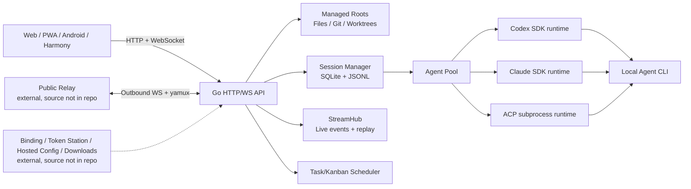

## 问题与范围

本次回答两个问题：MindFS 面向用户实际解决什么问题；源码中通过哪些模块和协议把本机 AI Agent、项目文件、会话、任务与远程访问组合起来。

## 速答

MindFS 是一个**自托管的本机 AI Agent 控制面与远程访问网关**。它本身不提供模型推理，而是启动、复用或恢复本机已经安装的 Codex、Claude Code 及 ACP 兼容 Agent，把各家不同的输出协议归一成统一的消息、思考、工具调用、计划、待办和完成事件，再通过 Web UI、PWA 和移动壳展示。

必须明确源码边界：本仓库基本包含完整的 **MindFS 本地节点**，但不包含完整的 **官方 MindFS 云端平台**。公网 Relay 服务端、账号登录与设备绑定后端、Token Station、托管 Agent 配置接口、移动端版本元数据和官方安装包托管均是外部服务；仓库中只有调用这些服务的客户端代码。因此它可以独立运行本地模式，但不能仅靠本仓库自建出与 `relay.a9gent.com` 等价的完整官方远程系统。

它围绕“项目目录”组织数据：文件访问、Git、worktree、会话历史、工具证据和任务看板都绑定到一个 managed root。会话元数据和 Agent 会话绑定保存在 SQLite，正文与结构化时间线保存在项目 `.mindfs/sessions/` 下的 JSONL 文件，因此项目迁移时可以带走主要会话数据。

实时交互采用 WebSocket。服务端 `StreamHub` 缓存正在生成的事件，浏览器断线重连后先用 HTTP 增量同步已持久化消息，再通过 `session.ready` 重放尚未落盘的流事件。发送请求带稳定 request ID，客户端会重发未确认请求，服务端负责去重。

公网访问不是让本机开放入站端口，而是本机主动向 Relay 建立 WebSocket，再在其上运行 yamux 多路复用，将公网 HTTP/WebSocket 请求反向代理回本机服务。可选 E2EE 使用 P-256 ECDH、HKDF-SHA256 和 AES-GCM 建立浏览器到 MindFS 节点的应用层加密会话。

## 关键证据

1. `cli/cmd/mindfs.go:64-86,195-220,233-267,278-313`：CLI 默认监听 `127.0.0.1:7331`，可复用已有后台服务、注册新的项目目录并打开浏览器，说明它首先是一个长期运行的本地服务而非一次性命令。
2. `server/app/server.go:75-190`：启动时组装目录注册表、Agent Pool、探测器、偏好、E2EE、Web Push、任务调度、HTTP API、WebSocket 和 Relay，显示 Go 服务端是整个系统的控制面。
3. `server/internal/agent/types/types.go:10-53,224-245` 与 `server/internal/agent/protocol.go:3-24`：所有 Agent 都实现统一 `Session` 接口并输出标准事件；Codex、Claude 和其他 Agent 分别走 Codex SDK、Claude SDK 与 ACP。
4. `server/internal/agent/pool.go:16-49,52-165`：Pool 按协议选择运行时、缓存 session handle，并将统一的 open-session 参数映射到三种底层实现。
5. `server/internal/api/usecase/session.go:1924-1989,2028-2146,2190-2223`：一次消息发送会锁定会话、恢复底层 Agent session、构造上下文、订阅并归一化流事件、追踪写文件工具，最后保存用户/Agent 消息、结构化辅助事件和底层 Agent session ID。
6. `server/internal/session/manager.go:29-107,1568-1663` 与 `server/internal/fs/fs.go:146-177,206-230`：会话索引及 Agent binding 使用 SQLite，正文和工具/思考时间线使用项目 `.mindfs/sessions/*.jsonl` 与 `*.aux.jsonl`。
7. `server/internal/api/stream_hub.go:19-69,602-619,707-724,898-923`、`server/internal/api/ws.go:937-949`、`web/src/services/session.ts:286-327,407-456,793-907,1006-1024`：服务端缓存未完成事件并按客户端重放；前端自动重连、重发未确认请求并在恢复会话后请求 replay。
8. `server/internal/relay/service.go:180-223,240-328,331-360`、`server/app/server.go:203-265`、`agents.json:430-431` 与 `server/internal/api/http.go:349-378`：本仓库实现的是 Relay/Token Station/托管配置的客户端；它会请求外部 `/api/bind/poll`、`/api/token-station/userinfo`、`/api/agents`，但本地路由没有实现这些云端端点。

## 细节展开

### 1. 产品定位

MindFS 把原本只能在终端中使用的 Agent CLI 变成可从浏览器和移动端操作的长生命周期工作台。它的主要能力分为六类：

- Agent 会话：流式回答、思考、工具调用、权限/提问、模型与模式切换、会话恢复、fork 和外部会话导入。
- 项目工作区：多项目目录、文件树、代码/Markdown/图片预览、Git status/diff/history 和 worktree。
- 任务编排：按模板定义用户阶段与 Agent 阶段，可控制并发、自动推进、会话复用和每任务 worktree。
- 远程访问：局域网直连、Relay 公网访问、可选 E2EE 和本地服务转发。
- 多端 UI：React Web/PWA，以及复用同一 Web UI 的 Android Capacitor 和 HarmonyOS 壳。
- 插件视图：项目 `.mindfs/plugins/*.js` 中的代码按文件匹配规则产生 JSON UI 树，扩展特定文件的浏览方式。

### 2. 技术栈与模块边界

- 后端：Go；HTTP 路由使用 chi，实时通信使用 Gorilla WebSocket，持久化使用 modernc SQLite，文件监听使用 fsnotify。
- Agent 接入：Codex SDK、Claude Agent SDK，以及通用 ACP JSON-RPC/ndJSON 子进程协议。
- 前端：React 19、TypeScript、Vite、Tailwind、Lexical、react-markdown、Mermaid 和 JSON Render。
- 远程通道：WebSocket 承载 yamux，多条公网 HTTP/WS 请求复用同一条本机主动建立的长连接。
- 移动端：Android 通过 Capacitor WebView，HarmonyOS 通过 ArkTS 壳加载同一套前端资源。

服务端的核心聚合点是 `AppContext`。每个 managed root 延迟创建自己的 `RootContext`，其中包含 `SessionManager` 与共享文件 watcher；全局共享 Agent Pool、StreamHub、Relay、任务调度、更新与通知服务。

### 3. Agent 统一适配原理

MindFS 定义了一层稳定的 `agenttypes.Session`。上层只使用 `SendMessage`、`SetModel`、`SetMode`、`CancelCurrentTurn`、`OnUpdate`、`SessionID` 等能力，不直接依赖某家 Agent 的协议。

底层分三条路径：

- Codex 使用 app-server SDK，并保留 thread/session ID 以便 resume 或 fork。
- Claude 使用 Claude Agent SDK 的流式传输，并支持 ask-user 与 subagent 事件。
- 其他 Agent 尽量通过 ACP 接入。ACP runtime 启动本地子进程，以 JSON-RPC/ndJSON 通信，一个 Agent 进程可承载多个逻辑 session。

适配器把各家事件转成统一事件类型；前端因此不需要分别理解 Codex、Claude 或 Gemini 的原始格式。

### 4. 双层会话模型

一个 MindFS 会话与底层 Agent 会话不是同一个对象：

- MindFS session key 负责产品层历史、名称、关联文件、任务、父子会话和 UI 展示。
- Agent session ID 负责让 Codex/Claude/ACP runtime 在自己的上下文中继续执行。

`session_agent_bindings` 将两者按 `(session_key, agent)` 绑定，同时保存该 Agent 已经接收的上下文序号。服务重启或内存 session 被回收后，MindFS 先读取 binding 尝试 resume；失败时才创建新的底层 Agent session，并按需要重新补上下文。

这也是同一 MindFS 对话中切换 Agent 仍能工作的基础：不同 Agent 各有自己的 binding 和上下文进度，而产品层共享同一份对话历史。

### 5. 一次消息的执行链

1. 前端通过 `session.message` 发送 root、session、Agent、模型、模式、消息及当前选择文件等上下文。
2. WebSocket handler 创建或定位 MindFS session；若上一轮仍在生成，新消息进入队列。
3. usecase 为该会话加发送锁，恢复或创建对应 Agent runtime session。
4. `BuildPrompt` 根据 Agent 已见上下文序号，仅补发所需历史与当前客户端上下文。
5. runtime 产生消息、思考、工具、计划、待办、compact、完成等事件；服务端归一化路径与事件形状。
6. StreamHub 实时广播；文件 watcher 根据写操作建立“会话生成/修改了哪些文件”的关联。
7. 回合结束后，文本和结构化辅助事件落盘，并更新 Agent session binding。

### 6. 持久化为什么混用 SQLite 与 JSONL

SQLite 保存适合查询和排序的结构化索引：会话列表、名称、时间、父子关系、任务关系、关联 worktree 和 Agent binding。JSONL 保存天然追加的对话正文；辅助 JSONL 保存思考、工具调用、计划、待办等按回答行位置插入的时间线信息。

这种组合让列表与搜索不必扫描全部聊天文件，同时使单个会话容易复制、调试和增量追加。项目目录不能写入 SQLite 时，代码还允许把数据库降级到用户配置目录，并在项目 `.mindfs` 中保存 link 文件。

### 7. 断线恢复不是简单重发提示词

持久层和直播层分开恢复：

- 浏览器 IndexedDB 缓存最后已持久化的 exchange seq，重新打开后通过 HTTP 只拉取更大的 seq。
- StreamHub 保留当前未完成回合的 `ReplyingList`。前端加载持久数据后发送 `session.ready`，服务端从 replay index 0 开始补发本轮直播事件，然后切换到 live。
- 尚未收到 `session.accepted` 的客户端请求会以相同 request ID 重发；服务端 request reservation 防止重复创建回合。
- Agent 流在已有部分输出后失败时，usecase 会进入 recovery；不可恢复错误或完全没有输出则直接失败。

### 8. Relay 与 E2EE

Relay 模式下，MindFS 使用设备凭据主动拨号到公网 Relay endpoint。WebSocket 被包装成 `net.Conn`，其上建立 yamux client；Relay 每转发一个请求就开一个 logical stream，本机读取其中的 HTTP request，再代理到本地 MindFS 或用户配置的其他本地服务。因此一般不需要路由器端口映射。

E2EE 位于应用层：浏览器与节点通过 pairing secret 对握手材料做 HMAC 证明，使用临时 P-256 ECDH 产生 shared secret，经 HKDF-SHA256 派生 256 位 transport key，HTTP/WS 敏感 payload 使用 AES-GCM envelope 加密。Relay 仍负责转发连接，但不需要获得会话明文密钥。

### 9. 任务看板与 worktree

任务模板由多个 stage 组成，每个 stage 可指定用户或 Agent、模型、模式、计划模式、提示词模板、是否自动推进和会话复用策略。任务可创建独立 Git worktree；进入 Agent stage 时 Kanban service 调用 `AppContext` 创建/复用 session，并通过同一 `SendMessage` 主链运行 Agent。任务系统因此是会话系统之上的编排层，而不是另一套 Agent runtime。

### 10. 仓库缺少的系统组成

从“完整官方产品”视角看，以下服务源码不在本仓库：

- 公网 Relay 接入端：接收节点 WebSocket、运行 yamux server、分配公网节点域名并将浏览器请求转入节点。
- 登录与设备绑定后端：提供 `/bind` 页面以及 `/api/bind/poll`，签发 device token、node ID 和 relay endpoint。
- Token Station 后端：提供用户信息、绑定以及 Agent API provider/token 相关的线上能力。
- 托管 Agent 配置服务：本地节点定时从官方 `/api/agents` 拉取并合并配置，但服务端实现不在仓库。
- 下载与版本服务：`mindfs-downloads`、Android/Harmony 版本接口及其制品存储属于官方基础设施。

以下内容不应算作“缺源码”：

- 发布签名私钥和移动应用签名材料。`Makefile` 要求从环境变量注入 release private key，Harmony 文档也明确要求签名文件不入库；这是正常的密钥隔离。
- 三个 `github.com/yandc/*-sdk` fork 没有 vendoring 到仓库，但其指定版本可从 Go module proxy 获取，属于外部开源依赖，而不是缺失文件。

仓库内还存在明确的未完成平台能力：`harmony/README.md:34-40` 列出了下载、后台轮询、持久化和若干原生 bridge 的待实现/替换项。因此 HarmonyOS 端不能视为与 Web/Android 完全等价。

## 未决问题

- 当前 README 将发布形态描述为“单二进制、内嵌 Web 资源”，但 `Makefile` 与安装脚本实际将 Go 二进制和 `web/dist` 静态资源分别安装；需要进一步核对发布流水线与已安装版本的准确口径。
- 插件代码通过前端 `new Function` 加载项目 `.mindfs/plugins/*.js`，当前探索尚未确认是否有额外沙箱或可信来源限制。
- StreamHub 的 replay 缓存主要位于内存；服务进程本身重启时，未完成回合能恢复到什么粒度需要单独探索 recovery 路径。
- 官方 Relay/Token Station 是否在其他公开仓库发布，当前 MindFS 仓库没有给出源码位置。

## 后续建议

下一步优先深入 Agent 会话内核：分别追 Codex、Claude 与 ACP 从原始协议事件到统一 `ToolCall`/`Thought`/`MessageChunk` 的转换和恢复差异。

## 相关文档

- `README.zh.md`
- `docs/capacitor-shell-prd.md`
- `.codestable/architecture/ARCHITECTURE.md`

## 2026-08-02 更新

在同步到 `c361350` 后重新核对源码边界，补充“本地节点源码基本完整、官方云端平台源码缺失”的结论，并区分正常未提交的密钥材料与实际未开放的服务端实现。
