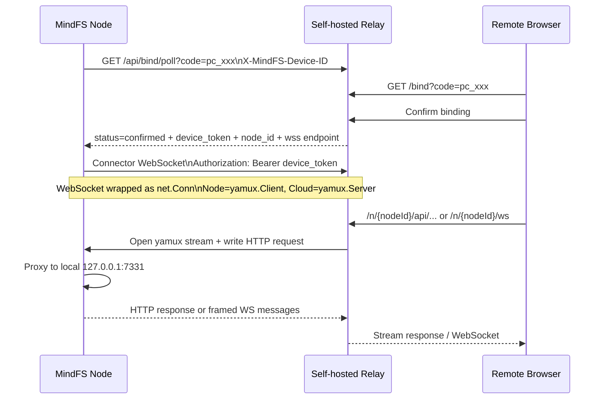

## 问题与范围

判断现有客户端是否给出了足够协议证据，使第三方能够实现一个与 `MINDFS_RELAY_BASE_URL` 兼容的自建云服务端；同时划分最小可用 Relay 与官方完整平台的范围。

## 速答

可以实现，而且不需要修改 MindFS 客户端。客户端明确允许 `MINDFS_RELAY_BASE_URL=https://你的服务端` 覆盖官方地址，并把绑定接口、凭据结构、Connector WebSocket、yamux 角色、HTTP 请求封装、WebSocket 帧桥接、节点公开路径与附加本地服务注册接口都暴露在源码中。

最小可用版只需一个 Go 服务：实现绑定确认、签发 node/device token、接受节点 Connector WebSocket、在该连接上建立 `yamux.Server`，并将 `/n/{nodeId}/*` 的公网 HTTP/WebSocket 请求通过新 yamux stream 转给节点。账号、Token Station、托管 Agent 配置、下载中心和附加本地服务域名都可以后补。



## 关键证据

1. `server/internal/relay/manager.go:61-75`：`MINDFS_RELAY_BASE_URL` 的优先级高于 `agents.json` 中的官方 Relay 地址，证明客户端原生支持替换云服务端。
2. `web/src/App.tsx:13340-13372` 与 `server/internal/relay/service.go:43-62,180-223`：浏览器打开云端 `/bind?code=...`；节点轮询 `/api/bind/poll`，成功响应必须包含 `device_token`、`node_id`、`node_name` 和 `endpoint`。
3. `server/internal/relay/service_test.go:166-205`：测试给出完整 confirmed 响应示例，Connector endpoint 示例为 `wss://relay.example.com/ws/connector`。
4. `server/internal/relay/service.go:331-377` 与 `server/internal/relay/wsconn.go:17-75`：节点以 Bearer token 建立 WebSocket，把二进制消息流包装为 `net.Conn`，并作为 `yamux.Client` 接受云端打开的逻辑 stream；云端因此应使用 `yamux.Server`。
5. `server/internal/relay/service.go:379-495`：每条 yamux stream 以原始 HTTP request 开头；普通 HTTP 返回原始 HTTP response，WebSocket 则在 101 响应后切换到自定义消息帧桥接。
6. `server/internal/relay/wsconn.go:104-244`：WebSocket 数据面帧格式已完整定义：data 为 `[1][opcode:1][length:uint32][payload]`，close 为 `[2][code:uint16][length:uint32][reason]`。
7. `web/src/services/base.ts:3-16,26-62` 与 `web/src/services/e2ee.ts:607-615`：公网节点路径固定使用 `/n/{nodeId}` 前缀，转发前需去掉该前缀；E2EE proof 也按去前缀后的节点真实路径计算。
8. `server/internal/relay/services.go:238-292` 与 `web/src/components/RelayLocalServicesDialog.tsx:78-91`：完整版本还可实现节点附加本地服务注册 API，以及 `{slug}-{nodeId}-relay.{domain}` 的 wildcard 域名转发。

## 细节展开

### 1. 最小控制面接口

#### `GET /bind`

显示绑定确认页面。客户端会传：

- `code`：节点本地随机生成的 `pc_...`。
- `node_name`：主机名，可选。
- `root`：绑定后希望打开的项目，可选，仅用于页面跳转。
- `purpose=token_station`：可选；Relay MVP 可以暂不支持。

单用户 MVP 可以使用管理员登录或预共享密码确认绑定；不能无条件自动确认任意 code，否则任何拿到地址的人都能注册节点。

#### `GET /api/bind/poll?code=...&purpose=...`

节点会带 `X-MindFS-Device-ID`。建议响应：

```json
{"status":"pending","next_poll_after_ms":3000}
```

确认后：

```json
{
  "status": "confirmed",
  "device_token": "随机高熵令牌",
  "node_id": "稳定且 URL 安全的节点 ID",
  "node_name": "Office Mac",
  "endpoint": "wss://relay.example.com/ws/connector"
}
```

客户端也识别 `claimed`、`expired`、`revoked` 作为终止状态。

### 2. Connector 接入

`endpoint` 路径由服务端决定，客户端只使用返回值。握手要求：

- WebSocket。
- `Authorization: Bearer {device_token}`。
- 二进制消息必须保持边界，但对 yamux 来说整体表现为连续可靠字节流。
- 可用 `X-MindFS-Relay-Node-Name` 响应头将云端修改后的节点名同步回客户端。
- token 永久失效时返回 `401` 与 `{"error":"device_token_invalid"}`；客户端会清除凭据并要求重新绑定。

云端将 WebSocket 包装为 `net.Conn` 后创建 `yamux.Server`。一个 node ID 同时只保留一个 active connector；新连接可替换旧连接，断线后将该节点标记 offline。

### 3. 公网 HTTP 转发

建议公开入口：

```text
https://relay.example.com/n/{nodeId}/{path...}
```

处理流程：

1. 根据 node ID 找到在线 yamux session。
2. 打开新 stream。
3. 将请求路径从 `/n/{nodeId}/api/tree` 改为 `/api/tree`。
4. 设置 `X-MindFS-Relayed: 1`，保留客户端 E2EE headers/body。
5. 设置/保留正确的 Host、Origin、`X-Forwarded-Host` 与 `X-Forwarded-Proto` 语义。
6. 使用 `req.Write(stream)` 写入标准 HTTP/1.1 请求。
7. 用 `http.ReadResponse` 读取节点返回并流式复制给公网客户端。

必须避免整包缓冲，否则文件下载、Agent 流式响应和大静态资源会产生高内存与延迟。

### 4. 公网 WebSocket 转发

浏览器访问 `/n/{nodeId}/ws?...` 时，云端需要：

1. 去掉节点路径前缀，将 `/ws?...` 作为原始 Upgrade request 写入 yamux stream。
2. 读取节点返回的 101 response，完成公网侧 WebSocket 升级并同步必要的子协议。
3. 公网 WebSocket → yamux 使用客户端定义的 data/close 帧格式。
4. yamux → 公网 WebSocket 解析同一格式并恢复 opcode、payload 和 close code。

这里是最容易出现兼容问题的部分，建议直接用 Go 和 Gorilla WebSocket 实现，并针对 text/binary/ping/close、子协议和大消息写互操作测试。

### 5. E2EE 对 Relay 的要求

E2EE 密钥由浏览器与本地节点建立，云端 Relay 不参与 ECDH/HKDF，也不应该解密 payload。Relay 只需：

- 原样转发 `X-MindFS-E2EE`、`X-MindFS-Client-ID`、`X-MindFS-Proof`、`X-MindFS-TS`。
- 原样转发加密 JSON body 和 WebSocket ciphertext。
- 正确去除 `/n/{nodeId}` 路径前缀，因为 proof 的 canonical path 是节点实际 `/api/...` 或 `/ws?...` 路径。
- 提供 HTTPS/WSS；浏览器 WebCrypto 流程要求 secure context。

这意味着云服务端即使完全自建，也可以保持“Relay 看不到文件和会话正文”的设计。

### 6. MVP 与完整平台的范围

#### MVP 必做

- pending code 状态机与绑定页面。
- node/device token 持久化及鉴权。
- Connector WebSocket registry。
- WebSocket-as-net.Conn。
- `yamux.Server` 生命周期管理。
- `/n/{nodeId}` HTTP 流式反向代理。
- `/n/{nodeId}/ws` WebSocket 桥接。
- TLS、超时、限流、连接清理和基础审计日志。

#### 可后补

- `/api/agents`：缺失时节点只记录刷新错误，仍会继续使用本地 `agents.json`。
- Token Station 与 provider/token 计费。
- 多用户/OAuth、节点共享与细粒度 ACL。
- `/api/device/nodes/{nodeId}/services/{slug}` 与 wildcard service domains。
- Android/Harmony 版本 API、制品托管和自动更新镜像。
- 节点列表、在线状态、重命名和运营后台。

### 7. 建议的服务端结构

初版可部署为一个 Go 进程：

- `binding`：pending code、确认、token 签发。
- `connector`：WebSocket 鉴权、yamux session registry。
- `gateway`：节点 HTTP/WS 入口和 stream 转发。
- `store`：PostgreSQL 保存节点/令牌/绑定，Redis 保存 pending code、在线连接元数据与多实例路由。

单实例验证阶段可先用 SQLite + 内存 registry；要横向扩容时，公网请求必须被路由到持有对应 node connector 的实例，常见方案是 sticky routing，或由边缘实例再转发到 connector owner。

### 8. 许可边界

MindFS 仓库使用 AGPL-3.0。若直接复制、修改或组合其 Relay 辅助代码并把服务通过网络提供给用户，需要按 AGPL 要求向这些用户提供相应源码。若只依据公开协议独立实现兼容服务，是否构成衍生作品仍应结合具体实现方式做法律审查；这不是法律意见。

## 未决问题

- 官方 Relay 对用户登录、节点所有权、共享访问和 node URL 授权的精确行为无法从客户端完全还原。
- 公网 WebSocket 握手是否还有官方私有响应头或网关限制，需要通过兼容测试确认。
- 多实例 connector 路由、流量计量、配额和滥用防护属于云平台设计，不由客户端协议决定。

## 后续建议

下一步可以把 MVP 收敛为正式设计，先实现单用户单实例 Relay，并以现有 MindFS 客户端做端到端兼容验收，再扩展账号和多节点能力。

## 相关文档

- `2026-08-02-explore-mindfs-purpose-and-architecture.md`
- `server/internal/relay/service.go`
- `server/internal/relay/wsconn.go`
- `server/internal/relay/services.go`
