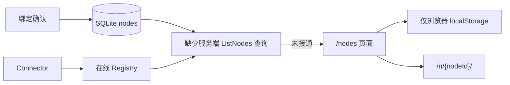

## 问题与范围

检查 `cloud` 服务端 V0 是否已形成用户可实际使用的闭环，重点回答：单用户 V0 已经保存节点信息时，用户访问 `/nodes` 是否能够直接找到并打开已绑定节点。

本次只读取仓库代码、CodeStable 规划与验收记录，并对 `https://relay.20260310.best` 做只读 HTTP/UI 检查；没有在本地启动或部署 Cloud，也没有修改 VPS。

## 速答

V0 的 Relay 数据面和部署基线已经完成：绑定、Connector、yamux、HTTP/WebSocket、E2EE 透明转发、SQLite、探活、指标和资源托管都有代码及既有验收证据，已部署 VPS 的 `/healthz`、`/readyz` 和 `/metrics` 也正常。

但 V0 的用户入口没有完成。Cloud 在 SQLite 中持久化 `node_id`、名称、状态和最近在线时间，内存 Registry 也知道当前在线状态；当前 `/nodes` 页面却只读取浏览器 `localStorage`，没有读取服务端节点。新浏览器、隐私模式或清理站点数据后，用户必须手工记住完整 `/n/{nodeId}/` URL。VPS 上客户端既有的 `GET /api/nodes` 尚未实现，证实服务端节点列表 API 未部署。

因此应区分两个结论：**按原 roadmap 的狭义协议验收，V0 三项均为 done；按单用户自托管产品的基本可用性，V0 尚未完整结束，缺少受 bootstrap 管理员保护的服务端节点发现闭环。** 多用户、共享、重命名、删除和 Token 轮换仍可留在 V1，但“列出自己的已绑定节点并打开”不应依赖多用户能力。

## 关键证据

1. `cloud/app/browser_handlers.go:23-36`：页面文案明确要求打开“this browser”保存的节点，脚本只读取 `mindfs_launcher_nodes` 的 `localStorage`，空时显示 `No node is saved in this browser.`；没有调用任何服务端节点接口。支撑“换浏览器后无法发现节点”。
2. `cloud/app/app.go:105-122`：路由表注册了 `/nodes`、绑定、Connector 和 `/n/` Gateway，但没有客户端既有的 `GET /api/nodes`。支撑“当前服务端没有节点列表 API”。
3. `cloud/internal/store/schema.sql:22-29`：`nodes` 表已经保存 `id`、`name`、`status`、`access_mode`、`created_at` 和 `last_seen_at`。支撑“服务端并非不知道节点地址和名称”。
4. `cloud/internal/store/contracts.go:66-77`：Store 只暴露单节点 `GetNode`，没有 `ListNodes`。支撑“缺口位于查询契约及上层 API，而非数据缺失”。
5. `cloud/internal/connector/registry.go:18-35`：`NodePresence` 和 `Status(nodeID)` 已能表达节点是否在线；Registry 以 node ID 保存 active session。支撑“列表可以组合 SQLite 节点与在线状态”。
6. `.codestable/roadmap/mindfs-cloud-relay/mindfs-cloud-relay-roadmap.md:715-764`：roadmap 将 V0 三项标为 done，却把节点列表和在线状态整体放入 V1 的 `cloud-node-management`。支撑“这是规划切分导致的产品闭环遗漏”。

## 细节展开

### 已完成的 V0 能力

- 独立 Cloud Go module、SQLite 控制面和单实例 Connector Registry 已落地。
- 未修改 MindFS 客户端的绑定、HTTP、WebSocket、E2EE 和重连兼容套件已有 passed acceptance。
- Docker/Caddy、配置校验、迁移、在线备份、readiness、metrics 和 `/mindfs-assets/` 已有 passed acceptance。
- 2026-08-04 对已部署 VPS 只读检查：`/healthz` 返回 200 `ok`，`/readyz` 返回 200 `ready`，`/metrics` 返回 200 且已有请求计数。

### 未完成的节点发现闭环

- VPS `/nodes` 实际页面只显示浏览器本地节点；当前浏览器没有记录时要求手工输入完整 Relay URL。
- VPS `/api/auth/me` 返回 `access_mode=node_auth`、`auth_required=false`，说明节点业务入口不要求 Cloud 登录。
- VPS 没有客户端既有的 `/api/nodes`，服务端没有可供页面读取的节点集合。
- 2026-08-04 对官方 `relay.a9gent.com` 只读检查：`/nodes` 是独立 Relay 控制台，其公开脚本调用 `GET /api/nodes`、`PATCH /api/nodes/{id}`、`DELETE /api/nodes/{id}`、`GET /api/auth/me` 和 `POST /api/auth/logout`；官方根路径 `/api/dirs` 与 `/api/relay/status` 均为 404。由此排除此前设想的 `/api/cloud/v1/nodes` 和根路径 `/api/dirs`。
- 绑定确认已经把节点写入 SQLite，但现有 Store 只能按已知 node ID 读取单节点；用户恰恰缺少的就是这个 ID。

### 边界判断

单用户不等于可以公开节点目录。节点列表应由现有 bootstrap 管理员 Session 保护，而 `/n/{nodeId}` 仍保持 `node_auth` 模式，由本地 MindFS 认证/E2EE 负责业务数据保护。

以客户端现有功能为准，闭环应提供：管理员登录后列出节点名称、node ID、在线状态、最近在线时间和可点击 `/n/{nodeId}/` 地址，并支持客户端现有的重命名与删除。Token 轮换、共享、租户和 ACL 仍可留在 V1。

## 未决问题

- roadmap 应把“只读节点发现”补入 V0 修正项，还是把 V0 状态改为存在已知缺口并立即启动一个独立 feature，需要用户决定。
- 官方客户端行为已确认 `/nodes` 与 `/login` 是独立页面；自托管 V0 使用现有 bootstrap 凭据适配该路由，不复制官方邮箱验证码或 OAuth。

## 后续建议

下一步应把“bootstrap 管理员通过客户端既有 Relay 控制台契约管理服务端节点”作为 V0 修正项，实现 `/login`、`/api/auth/me`、`/api/auth/logout`、`GET/PATCH/DELETE /api/nodes` 与 `/nodes` 页面；不修改客户端。

## 相关文档

- `.codestable/roadmap/mindfs-cloud-relay/mindfs-cloud-relay-roadmap.md`
- `.codestable/features/2026-08-03-relay-core-single-instance/relay-core-single-instance-acceptance.md`
- `.codestable/features/2026-08-03-relay-deployment-baseline/relay-deployment-baseline-acceptance.md`
- `.codestable/features/2026-08-03-relay-browser-recovery/relay-browser-recovery-ff-note.md`
- `.codestable/compound/2026-08-02-explore-self-hosted-relay-server-feasibility.md`
