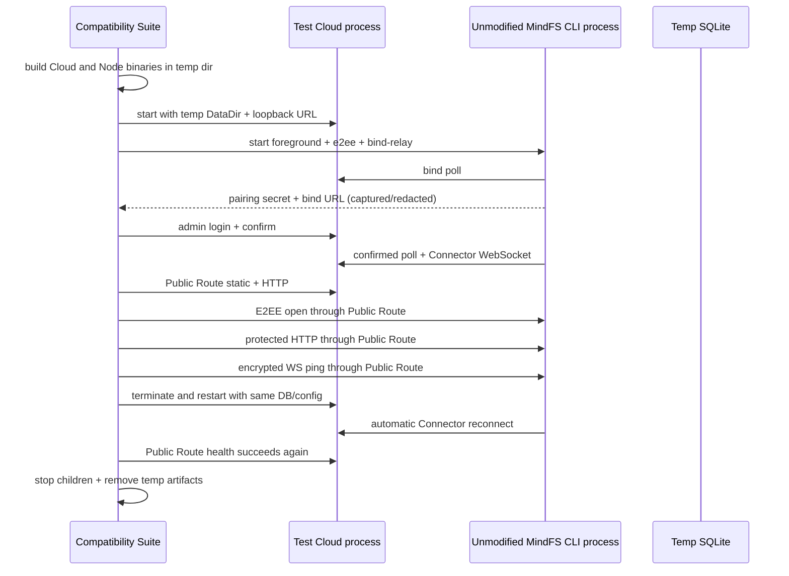

# Relay 黑盒兼容测试套件

## 0. 术语约定

| 术语 | 定义 | 防冲突结论 |
|---|---|---|
| Compatibility Suite | 本 feature 新增的 opt-in 黑盒测试包 | 不指现有 cloud 单元/集成测试，也不指未来跨版本矩阵 |
| Test Cloud | Compatibility Suite 启动的真实 `mindfs-relay` 子进程 | 使用生产入口和临时 SQLite，不使用 `httptest` App |
| Test Node | Compatibility Suite 启动的未修改 `cli/cmd` 二进制 | 仍是 MindFS Node，只在测试语境下称 Test Node |
| Compatibility Run | 一次完整的构建、启动、绑定、转发、重启和清理过程 | 每次使用独立临时目录与随机本地端口 |
| E2EE Test Client | 仅依赖公开 HTTP/WS 契约实现的测试侧 E2EE 客户端 | 不 import `server/internal/e2ee`，用于证明 Cloud 未破坏密文与 proof path |
| Process Harness | 管理 Test Cloud/Test Node 生命周期、输出解析和超时的测试编排器 | 不进入生产二进制，不替代部署进程管理 |

术语 grep 已核对：

- `cloud/app/protocol_integration_test.go` 使用模拟 Node，只覆盖 Cloud 内协议级端到端测试。
- `.codestable/roadmap/mindfs-cloud-relay/mindfs-cloud-relay-roadmap.md:688-700` 定义黑盒兼容验收契约。
- `server/cmd/mindfs-server` 不提供 E2EE CLI 参数；`cli/cmd/mindfs.go:64-85` 提供 `-foreground`、`-bind-relay`、`-e2ee`，因此 Test Node 必须使用 CLI 入口。
- `server/internal/e2ee` 与 `web/src/services/e2ee.ts` 是协议证据，不作为测试代码依赖。

## 1. 决策与约束

### 需求摘要

为 Cloud Relay 提供可重复执行的真实客户端兼容测试。测试从 cloud 侧构建或使用未修改 MindFS CLI，启动真实 Cloud 和 Node，完成管理员确认绑定，然后从 Public Node Route 验证静态内容、HTTP、E2EE HTTP、E2EE WebSocket 和 Cloud 重启后的 Node 自动重连。

成功标准：

- 默认 `go test ./...` 不启动重型子进程；显式启用后，一条命令可以运行完整 Compatibility Run。
- Test Node 必须由当前仓库未修改的 `cli/cmd` 构建，或由调用者提供预构建 Node binary；测试代码不 import 上游 internal 包。
- Test Cloud 与 Test Node 使用真实 TCP 监听、真实 HTTP/WebSocket 和真实磁盘凭据，不使用模拟 Connector。
- Compatibility Run 完成绑定、Public Route HTTP、静态资源重写、E2EE HTTP、E2EE WS ping/pong、Cloud 重启和 Node 重连。
- 所有子进程、端口和临时目录在成功、失败与超时路径都可清理；失败输出不泄露 pairing secret、Device Token、管理员密码或密文 payload。
- 测试执行前后，现有 MindFS 只读路径没有文件变化。

### 明确不做

- 不修改 `server/`、`web/`、`cli/`、`android/`、`harmony/`、根 `go.mod`、`go.sum`、`Makefile`、`agents.json` 或现有上游测试。
- 不在本 feature 修复 Compatibility Run 发现的 Cloud/Node 协议缺陷；缺陷按 `cs-issue` 单独修复后重跑套件。
- 不使用真实模型 Agent，不执行会话、文件写入、Git 操作或任务工作流。
- 不访问官方 Relay、Token Station、GitHub release、Hosted Agents 或其他外部网络服务。
- 不做真实浏览器 UI 自动化、截图或前端交互测试；HTTP/WS 客户端直接验证公开协议。
- 不建立历史版本、多个操作系统和移动端的完整矩阵；V0 默认验证当前 checkout，并允许传入一个预构建 Node binary。
- 不新增 Docker、TLS 反代、readyz、备份或生产进程守护；这些属于 `relay-deployment-baseline`。
- 不修改 Cloud Relay 生产路由、schema、配置键或运行行为。

### 复杂度档位

- 健壮性 = L3：子进程、网络、超时和清理均有明确失败语义。
- 安全性 = sandboxed（偏离对外服务默认 validated）：Test Node 使用隔离 HOME、临时目录、收紧 PATH 和拒绝外部网络的代理环境。
- 可测试性 = verified（偏离默认 tested）：真实进程覆盖主闭环，并对不写上游、密钥不输出和重连不变量做断言。
- 可观测性 = logged（偏离默认 traced）：测试失败提供阶段、进程退出码和脱敏后的有限日志，不引入 tracing。
- 性能 = reasonable（偏离默认 budgeted）：兼容测试关注协议正确性；通过构建缓存和单场景复用进程控制时长，不设延迟预算。
- 确定性 = reproducible：随机端口和密钥只影响值，不影响步骤与断言；每步有固定截止时间。
- 兼容性 = current-only + binary override：V0 默认当前 checkout，允许指定预构建 Node binary；完整 cross-version matrix 留给 `cloud-api-lifecycle`。

### 关键决策

1. **Cloud 与 Node 都使用真实二进制子进程**
   Test Cloud 从 `cloud/cmd/mindfs-relay` 构建，Test Node 从根仓库 `cli/cmd` 构建。拒绝在进程内调用 `app.New` 或模拟 Node，因为那无法覆盖环境配置、进程启动、真实 Connector 和重连。

2. **使用 CLI 入口启动 Test Node**
   CLI 的 `-e2ee -foreground -bind-relay` 会生成 E2EE 配置、启动 Node 并触发绑定；直接使用 `server/cmd/mindfs-server` 无法从命令行启用 E2EE。

3. **兼容套件默认 opt-in**
   `MINDFS_RUN_COMPAT=1` 才运行重型场景；普通 `go test ./...` 保持快速。该模式与仓库现有 `MINDFS_RUN_REAL_AGENT=1` 实测约定一致。

4. **E2EE Test Client 独立实现公开协议**
   测试侧基于 P-256、HMAC-SHA256、HKDF 和 AES-GCM 实现 open/request proof/envelope，不 import `server/internal/e2ee`。拒绝共享内部实现，因为共享代码会让双方同错而测试仍通过。

5. **静态页面使用临时 fixture，但由真实 Node 提供**
   Compatibility Run 在临时目录创建最小 `index.html`、favicon 和 asset，设置 `MINDFS_STATIC_DIR`；断言 Public Route 返回 Node 内容并按上游契约把 `./assets/` 重写为 `/mindfs-assets/`。不写 `web/dist`。

6. **Cloud 重启复用地址、DataDir 和 Token Key**
   Suite 强制终止 Test Cloud，再用同一配置启动；Test Node 保持运行并使用持久化 Device Token 自动重连。拒绝只断开单条 stream，因为那不能验证 SQLite 与进程级恢复。

7. **测试环境阻断无关外部副作用**
   Test Node 使用最小 PATH 防止启动本机 Agent，`HTTP_PROXY/HTTPS_PROXY` 指向不可达本地端口并为 localhost 设置 `NO_PROXY`，避免 update/hosted 请求访问公网。

8. **发现的协议缺陷独立修复**
   当前 spike 已发现 Cloud 发送 `X-MindFS-Relayed: true`，而 Node `server/internal/api/http.go:1452-1458` 只接受 `1`。Suite 必须先把该契约写成失败测试；生产修复走独立 issue，不混入本 feature。

### 假设

- 执行环境提供 Go toolchain，并允许在 loopback 上启动两个子进程。
- V0 Compatibility Run 的总截止时间默认 120 秒，单个启动/重连阶段默认 15 秒。
- 预构建 Node binary 必须接受当前 CLI 的 `-foreground`、`-bind-relay`、`-e2ee`、`-web-push` 和 `-addr` 参数。
- Windows 进程差异不在本 feature 建立专门矩阵；进程清理使用 Go `Process.Kill` 和 `Wait` 的跨平台最小语义。

## 2. 名词与编排

### 2.1 名词层

#### 现状

- `cloud/app/protocol_integration_test.go:23` 已覆盖 Binding → 模拟 Connector → HTTP/WS，但 Node 是测试内 yamux client，不是现有 MindFS 二进制。
- `cli/cmd/mindfs.go:185-193` 生成 E2EE 配置；`cli/cmd/mindfs.go:278-326` 启动真实 Node 并可自动触发 Relay binding。
- `server/internal/relay/manager.go:336-383` 持续 poll，confirmed 后保存凭据并启动 Connector。
- `server/internal/api/http.go:2255-2335` 暴露 Relay 状态；`server/internal/api/http.go:2346-2415` 暴露 E2EE open。
- `server/internal/api/ws.go:210-279` 验证 E2EE WebSocket proof 并处理密文消息。
- 当前没有从 `cloud/**` 启动真实 CLI 并完成上述闭环的测试包。

#### 变化

新增测试侧值对象与契约：

```go
type SuiteConfig struct {
    RepoRoot       string
    CloudBinary    string
    NodeBinary     string
    TotalTimeout   time.Duration
    StageTimeout   time.Duration
}

type ProcessSpec struct {
    Name    string
    Binary  string
    Args    []string
    Env     []string
    WorkDir string
}

type BindObservation struct {
    Code          string
    PairingSecret string
    NodeName      string
}

type E2EESession struct {
    ClientID string
    NodeID   string
    Key      []byte
}
```

测试入口示例：

```text
cd cloud
MINDFS_RUN_COMPAT=1 go test ./compat -run TestUnmodifiedNodeRelayCompatibility -v
```

可选预构建 Node：

```text
MINDFS_RUN_COMPAT=1 \
MINDFS_COMPAT_NODE_BINARY=/path/to/mindfs \
go test ./compat -run TestUnmodifiedNodeRelayCompatibility -v
```

未显式启用：

```text
go test ./...
ok/skip: relay compatibility suite requires MINDFS_RUN_COMPAT=1
```

启动或协议失败的输出只包含阶段和脱敏错误：

```text
compat stage=node_bind failed: bind URL was not observed before timeout
```

禁止把完整 stdout、bind code、pairing secret、Device Token、Authorization 或密文写入失败信息。

### 2.2 编排层



#### 现状

当前 Cloud 测试在一个 Go test 进程内装配 App，并用测试实现模拟 Node。它能证明 Cloud 内部协议，但不能证明根仓库 CLI 参数、用户配置目录、凭据文件、重连循环和真实 Node HTTP/WS handler 与 Cloud 兼容。

#### 变化

Compatibility Suite 新增一条线性 workflow，阶段失败即终止并清理：

1. **Preflight**：检查 opt-in、定位 repo/cloud 根、分配 loopback 端口、创建临时 HOME/DataDir/static/root。
2. **Build**：构建真实 Cloud；未提供 `MINDFS_COMPAT_NODE_BINARY` 时构建当前 checkout CLI，并注入标准 release version 以启用 relayed asset 重写路径。
3. **Start Cloud**：使用六个 V0 环境变量启动，轮询 `/healthz`。
4. **Start Node**：使用隔离 HOME、最小 PATH、无外网代理和 `MINDFS_RELAY_BASE_URL` 启动 CLI；从流式 stdout 只提取 pairing secret、bind code 和 node name，原始敏感行不进入 test log。
5. **Bind**：调用 Cloud 管理员 login/confirm，轮询 Public Route 直到 Connector online。
6. **HTTP**：验证 `/health`、fixture index、fixture asset、method/query/body 和 relayed asset rewrite。
7. **E2EE HTTP**：通过 Public Route open session；构造 canonical path proof，验证加密 response 可解密且字段正确。
8. **E2EE WebSocket**：构造去掉 Relay 前缀且排除 proof 参数的 WS proof，发送加密 ping，读取并解密 pong。
9. **Restart**：终止 Test Cloud，复用地址/DataDir/Token Key 重启；等待 Test Node 自动 Connector reconnect，再次验证 `/health`。
10. **Cleanup**：无论成功、失败或超时，关闭 WebSocket、终止子进程、等待退出并删除临时目录。

#### 流程级约束

- **黑盒边界**：兼容测试不得 import `mindfs/server/internal/**` 或链接 root module；与 Node 的交互只走二进制参数、stdout 和公开 HTTP/WS。
- **隔离**：每次 run 使用独立 HOME、Cloud DataDir、Node root 和 static dir；不得读取或覆盖用户真实 `~/.config/mindfs`。
- **无外网**：localhost 必须绕过代理；其他 HTTP(S) 请求快速失败，不依赖公网可用性。
- **敏感信息**：输出 parser 可在内存持有 pairing secret/bind code；日志和 error 必须脱敏，结束时 E2EE key 清零。
- **时限**：所有 process wait、health、bind、Connector、HTTP、WS 和 reconnect 都受 context deadline 控制；禁止无界 goroutine/ReadLine。
- **清理顺序**：先关闭客户端连接，再终止 Node，最后终止 Cloud；每个进程必须 `Wait` 回收。
- **失败定位**：错误包含阶段、进程名和有限状态，不包含原始完整 stdout；可保留最近若干条已脱敏日志。
- **重连真实性**：Restart 阶段不得重新确认绑定、删除 Node credentials 或重启 Node。
- **扩展点**：未来 cross-version matrix 通过 `MINDFS_COMPAT_NODE_BINARY` 或外层 CI 参数重复运行同一场景，不复制测试逻辑。
- **源码只读**：构建输出、静态 fixture、HOME 和数据库全部在测试临时目录；feature 文件只落在 `cloud/compat/**`。

### 2.3 挂载点清单

1. **Compatibility test package：`cloud/compat/`** — 新增真实进程黑盒测试入口与测试侧协议客户端。
2. **显式运行开关：`MINDFS_RUN_COMPAT`** — 新增测试环境变量；未设置时重型套件 skip。
3. **Node binary override：`MINDFS_COMPAT_NODE_BINARY`** — 新增测试环境变量；允许对预构建未修改客户端复用同一套件。
4. **Compatibility 使用说明：`cloud/compat/README.md`** — 新增运行命令、依赖、隔离边界和失败排查入口。

删除以上四项后，Compatibility Suite 在代码、命令和使用者视角完全消失；Cloud Relay 生产行为不变。

### 2.4 推进策略

1. **编排骨架**：建立 opt-in Compatibility Run、临时目录、端口和阶段超时，Cloud/Node 节点先只启动到 health。
   退出信号：显式命令能构建两个二进制、启动并可靠清理，默认 `go test ./...` 只 skip 重型场景。

2. **绑定计算节点**：接通 CLI stdout 观察、管理员 login/confirm 和真实 Connector 等待。
   退出信号：未修改 CLI 完成 pending → confirmed，Public Route `/health` 返回 Node 的 `ok`。

3. **HTTP 与静态计算节点**：接通 fixture index/asset、method/query/body 和 relayed asset rewrite 断言。
   退出信号：真实 Node 的静态内容和 HTTP API 经 Public Route 保持，错误 Header 值能被测试发现。

4. **E2EE 计算节点**：实现独立 E2EE Test Client，接通 open、protected HTTP 和 encrypted WebSocket ping/pong。
   退出信号：密文可在测试端解密，proof 使用 Node canonical path，WS pong 顺序正确。

5. **重连与生命周期**：复用 SQLite/config 重启 Test Cloud，验证 Node 自动重连和所有失败路径清理。
   退出信号：不重新绑定即可恢复 Public Route；测试结束无残留监听端口和子进程。

6. **完整验证**：补齐错误、脱敏、只读边界和预构建 binary override。
   退出信号：全部验收场景有证据，专用兼容命令通过，普通 cloud tests/race/vet 继续通过。

### 2.5 结构健康度与微重构

#### 评估

- Compound convention 检索：未找到目录组织、测试归属或命名 convention。
- 文件级：本 feature 不修改现有 Cloud 生产文件；可能只在现有测试命令文档旁增加引用，不向 `cloud/app/protocol_integration_test.go` 继续追加真实进程逻辑。
- 目录级：`cloud/` 当前按 `app`、`cmd`、`internal` 分责；真实黑盒测试横跨两个 module，不属于任一生产 internal 包。新建 `cloud/compat/` 能把进程 harness、E2EE client 和 scenario 从生产代码隔离。
- 新目录初始预计拆为 scenario、process harness、E2EE client 和 README，职责相关且不会形成摊平目录。

#### 结论：不做微重构

原因：现有生产文件不需要搬移；新测试能力有独立目录和清晰测试侧职责。把现有模拟协议测试搬入 compat 会改变测试层级和默认运行成本，不属于“只搬不改行为”。

## 3. 验收契约

### 正常场景

1. 未设置 `MINDFS_RUN_COMPAT` 运行 `go test ./...` → Compatibility Suite 明确 skip，其他 Cloud tests 通过。
2. 设置 `MINDFS_RUN_COMPAT=1` 且未提供 binary override → Suite 从当前 checkout 构建真实 Cloud 和 CLI 到临时目录。
3. Test Cloud 与 Test Node 启动 → 两个 health endpoint 在阶段时限内可达，Node stdout 中可观察 E2EE secret 和 bind URL，但测试日志不输出原值。
4. Suite 管理员确认 bind code → 未修改 Node 保存凭据并建立真实 Connector，Public Route `/health` 返回 `ok`。
5. 访问 Public Route 根和 fixture asset → 返回 Test Node 内容；标准 release 下 `./assets/` 被重写为 `/mindfs-assets/`。
6. 通过 Public Route 发送 HTTP method/query/body → Node 返回与输入对应的可验证响应，路径不含 `/n/{nodeId}`。
7. E2EE Test Client 通过 Public Route open session → server proof 验证通过并派生 32 字节 transport key。
8. 带 E2EE headers 的 protected HTTP → proof 使用 Node canonical path，response envelope 可解密为预期 JSON。
9. 带 E2EE query proof 的 WebSocket → 连接成功；发送 encrypted ping 后收到可解密的 pong，公网只观察 envelope。
10. Test Cloud 使用同一地址、DataDir 和 Token Key 重启 → Test Node 不重新绑定自动重连，Public Route `/health` 恢复。
11. 提供 `MINDFS_COMPAT_NODE_BINARY` → Suite 跳过 Node build，使用指定未修改 binary 完成相同场景。

### 边界场景

12. 随机端口在启动前被占用 → 当前 run 明确失败并清理已启动进程，不尝试未知固定端口。
13. Test Node 输出分块跨行或启动较慢 → parser 持续读取到 deadline，不依赖一次 `Read` 得到完整 URL。
14. Node 在 confirmed 前重复 poll → Suite 只确认一次，绑定保持幂等。
15. Cloud Restart 窗口内公网请求失败 → Suite 持续重试到 deadline，不误判第一次连接拒绝为最终失败。
16. WebSocket 先收到无关初始事件 → Suite 解密并跳过，直到匹配本次 ping request ID。
17. Compatibility Run 中途失败 → Node、Cloud、WS、stdout reader 和临时目录均清理，无残留端口。
18. 测试进程收到 context cancel → 所有子进程被终止并 `Wait`，不留下 zombie。

### 错误场景

19. Go toolchain 缺失或 Cloud/Node build 失败 → 测试在 build 阶段失败，报告 binary 名与脱敏后的编译摘要。
20. Cloud 配置错误或 SQLite 不可用 → Test Cloud 未健康，Suite 不启动 Node。
21. Node 在时限内未输出 bind URL → node_bind 阶段失败，不打印完整 stdout 或 pairing secret。
22. 管理员登录/确认返回非 2xx → bind_confirm 阶段失败，不继续等待 Connector。
23. Public Route 持续返回 404/503/504 → connector_wait 阶段失败并给出最后状态码。
24. E2EE server proof 不匹配、envelope 解密失败或 canonical path 错误 → 对应 e2ee 阶段失败。
25. WebSocket 握手、密文 ping/pong 或 close 失败 → ws_e2ee 阶段失败并释放连接。
26. Cloud 重启后 Node 未在 deadline 内重连 → reconnect 阶段失败，不重新绑定掩盖问题。
27. `MINDFS_COMPAT_NODE_BINARY` 不存在或不支持所需 CLI 参数 → preflight/start 阶段明确失败。

### 明确不做的反向核对

28. git diff 不应出现 `server/`、`web/`、`cli/`、`android/`、`harmony/`、根 `go.mod`、`go.sum`、`Makefile` 或 `agents.json`。
29. `cloud/compat` 不应 import `mindfs/server/internal`、`mindfs/server/app` 或根 module 包。
30. Compatibility Run 不应连接非 loopback Relay/Node 地址或成功访问外部 HTTP(S) 服务。
31. 测试日志不应包含实际 pairing secret、bind code、Device Token、Authorization、E2EE key、ciphertext 或业务 payload。
32. 测试不应启动 codex/claude/gemini 等真实 Agent 进程。
33. 本 feature 不应新增生产路由、SQLite 表、Cloud 配置键、Dockerfile、反代模板、浏览器自动化或跨版本矩阵配置。
34. Compatibility Suite 发现的 `X-MindFS-Relayed` 等生产缺陷不应在本 feature 的测试文件改动中被偷偷修复。

## 4. 与项目级架构文档的关系

本 feature 不改变 Cloud Relay 运行时结构，但建立长期可见的兼容验证边界。Acceptance 阶段应：

- 更新 `architecture/cloud-relay-core.md`，增加“黑盒兼容验证”说明和专用运行命令。
- 记录 Test Cloud/Test Node 使用真实进程、E2EE client 独立实现、默认 opt-in、上游源码只读和外网隔离为稳定测试约束。
- 不新增运行时子系统架构 doc，不修改 Binding、Connector、Gateway 或 Store 的现状描述。
- Requirement `mindfs-compatible-cloud-backend` 已是 current；本 feature 不改变用户能力边界，只在 `implemented_by` 不变的前提下增加验收证据。
- Acceptance 通过后把 roadmap item `relay-compatibility-suite` 更新为 done；随后 `relay-deployment-baseline` 的依赖满足。
