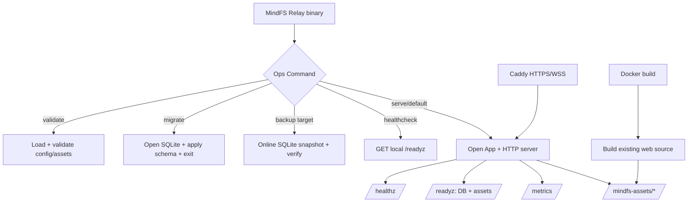

# Relay 部署基线

## 0. 术语约定

| 术语 | 定义 | 防冲突结论 |
|---|---|---|
| Deployment Baseline | V0 可重复构建和运行 Cloud Relay 的最小生产部署能力 | 不等于后续多实例、SLO 或灾备体系 |
| Ops Command | `mindfs-relay` 进程的 validate、migrate、backup、healthcheck 子命令 | 不新增第二个运维二进制 |
| Readiness Probe | `/readyz` 对 SQLite 和 Asset Bundle 可用性的即时检查 | `/healthz` 仍只表示进程存活 |
| Metrics Snapshot | `/metrics` 暴露的 Prometheus text format 基础进程/HTTP 指标 | 不包含完整 tracing、业务计费或 SLO |
| SQLite Backup | 使用 SQLite 在线一致性机制生成的单文件快照 | 不是复制正在写入的 db/wal/shm 文件 |
| Asset Bundle | 当前 checkout `web/dist` 的只读构建产物 | Cloud 只托管 `/mindfs-assets/` 对应的 `assets/` 子目录 |
| Container Stack | Cloud Relay + Caddy 的示例 Compose 部署 | 示例不引入 Kubernetes 或云厂商资源 |

术语检索未发现现有实现冲突；roadmap 第 4.13 节是本 feature 的部署契约来源。

## 1. 决策与约束

### 需求摘要

把已经通过真实客户端兼容测试的 Cloud Relay 变成可重复部署的 V0 服务：启动前可校验配置，显式执行迁移和在线 SQLite 备份，区分 liveness/readiness，提供基础 Prometheus 指标，用容器构建当前 Web 资源并托管 `/mindfs-assets/`，再通过 Caddy 示例提供 HTTPS/WSS。

成功标准：

- 独立命令可验证配置、执行幂等迁移、生成可打开的一致性备份和检查 readiness。
- `/healthz`、`/readyz`、`/metrics` 语义清晰；数据库或 assets 不可用时 readiness 失败。
- `MINDFS_CLOUD_ASSETS_DIR` 必须指向包含 `index.html` 与 `assets/` 的只读 Web bundle；`/mindfs-assets/{path}` 只返回 bundle 的 assets 文件。
- 从仓库根构建容器时同时构建未修改 `web/` 与 `cloud/`，最终镜像以 non-root 用户运行且不包含源码/toolchain。
- Compose + Caddy 示例可持久化 SQLite、自动 TLS、透传 WebSocket，并有 healthcheck 与手工 backup 命令。

### 明确不做

- 不修改或向 `server/`、`web/`、`cli/`、移动端和根构建文件写入代码/产物。
- 不实现 Kubernetes、Helm、systemd、云厂商 Terraform、自动扩缩容或多实例共享状态。
- 不实现 PostgreSQL、Redis、远端对象存储、增量备份、自动备份调度、保留策略或灾备恢复编排。
- 不引入应用内 TLS/证书签发；HTTPS/WSS 由 Caddy 等反向代理终止。
- 不公开管理员/Token/SQLite 路径等敏感 metrics，不增加 tracing 或业务 SLO。
- 不托管 index.html、service worker 或 PWA 根资源；这些仍经 Public Node Route 返回，Cloud 只托管重写后的 `/mindfs-assets/`。
- 不修改 Binding、Connector、Gateway 数据协议、SQLite schema 或现有客户端行为。

### 复杂度档位

- 健壮性 = L3：启动、迁移、备份、探活和关闭都必须有确定错误语义。
- 安全性 = validated：配置/路径严格校验、静态文件防遍历、容器 non-root、日志不含 secret。
- 可测试性 = verified：文件系统、SQLite、HTTP 与真实容器配置均有自动证据；Docker 不可用时保留静态校验。
- 可观测性 = metrics（偏离默认 logged）：新增 readiness 与 Prometheus 基础指标，但不做 tracing。
- 确定性 = reproducible：固定构建输入、幂等迁移、backup 不覆盖已有文件。
- 兼容性 = backward-compatible：现有 serve 无参数入口保留，但新增 required assets 配置属于 V0 部署契约同步升级。

### 关键决策

1. **单 binary 多 Ops Command**：默认或 `serve` 启动服务，`validate`、`migrate`、`backup`、`healthcheck` 复用同一配置定义，避免运维脚本复制配置解析。
2. **启动仍自动迁移，另提供显式 migrate**：保持现有首次启动体验，同时允许部署流水线在切流量前幂等执行迁移。
3. **SQLite backup 使用在线一致性快照**：拒绝直接复制 db/wal/shm；目标文件必须不存在，避免误覆盖。
4. **readiness 检查 DB + assets**：liveness 不依赖外部状态；readiness 只有数据库可 ping 且 Asset Bundle 完整时才为 200。
5. **Cloud 托管共享 hashed assets**：容器构建当前 `web/dist` 并从只读目录提供 `/mindfs-assets/`，补齐真实 release 页面资源闭环。
6. **TLS 留在反代**：Caddy 示例保留原 Host/Proto 和 WebSocket Upgrade，Cloud 根据 public URL 生成 wss endpoint。
7. **容器从仓库根构建但只写镜像层**：Docker build 可读取 `web/`，不向 workspace 生成 `web/dist`。

## 2. 名词与编排

### 2.1 名词层

#### 现状

- `config.Config` 只有六个核心运行配置，没有 assets 目录。
- `app.App` 持有 SQLite Store、Binding、Connector 和 Gateway，只暴露 `/healthz`。
- `store.OpenSQLite` 在打开数据库时执行 embedded schema，缺少显式 migrate/backup 契约。
- `cmd/mindfs-relay` 只有 serve 流程。

#### 变化

```go
type Config struct {
    // existing fields...
    AssetsDir string
}

type BackupResult struct {
    Source      string
    Destination string
    SizeBytes   int64
}

type Metrics interface {
    ObserveHTTP(method string, status int, duration time.Duration)
    Render(io.Writer) error
}
```

配置示例：

```text
MINDFS_CLOUD_ASSETS_DIR=/opt/mindfs/web
# 来源：roadmap 4.13 deployment contract
```

Ops Command 示例：

```text
mindfs-relay validate
configuration valid

mindfs-relay migrate
migration complete

mindfs-relay backup /backups/mindfs-cloud-20260803.db
backup complete path=/backups/mindfs-cloud-20260803.db size_bytes=12345
```

HTTP 示例：

```http
GET /readyz
200 {"status":"ready"}

GET /mindfs-assets/index-abc.js
200 Cache-Control: public, max-age=31536000, immutable

GET /mindfs-assets/../mindfs-cloud.db
404
```

### 2.2 编排层



#### 现状

`main` 线性执行 config load → app.New/auto-migrate → ListenAndServe → signal shutdown。所有 request 经过 request ID/log middleware；没有运维分支、readiness、metrics、assets 或容器装配。

#### 变化

1. 入口先解析 Ops Command；除 healthcheck 外均复用完整配置加载。
2. serve 装配 readiness、metrics 和 assets handler，同时保留原有业务路由与自动迁移。
3. request metrics middleware 包裹全部路由，按 method/status 聚合，不记录 path/query/body。
4. backup 打开源 SQLite，使用在线一致性快照写新目标，再打开目标执行 integrity check。
5. Docker build 在独立 stage 运行 Web build，最终镜像只复制 Cloud binary 和 Web bundle。
6. Compose 启动 Cloud 与 Caddy，数据/备份目录持久化，Caddy 终止 TLS 并反代全部流量。

#### 流程级约束

- 配置错误、assets 缺失、迁移失败时 serve/migrate/backup 在监听前失败。
- validate 不打印 password、Token Key 或其他 secret；backup 输出只含目标路径和大小。
- migrate 幂等；backup 目标已存在、等于源文件、父目录不可写或 integrity check 失败时不覆盖/不报告成功。
- `/healthz` 只依赖进程；`/readyz` 每次检查 DB ping 与 Asset Bundle，不缓存失败。
- `/metrics` 不鉴权但只含低敏聚合值；请求日志与 metrics 都不记录 URL query/body。
- assets handler 只允许普通文件，拒绝空路径、目录、遍历、symlink 越界和不存在文件。
- 容器以固定 non-root UID 运行，只有 data/backup volume 可写，assets 和 binary 只读。
- 优雅关闭保持 10 秒 deadline；SIGTERM 后不接受新连接并等待 in-flight 请求。

### 2.3 挂载点清单

1. **配置键 `MINDFS_CLOUD_ASSETS_DIR`** — 新增 required Asset Bundle 路径。
2. **HTTP endpoints `/readyz`、`/metrics`、`/mindfs-assets/`** — 新增部署探针、指标和共享资源入口。
3. **Ops Commands `validate|migrate|backup|healthcheck|serve`** — 扩展 `mindfs-relay` 进程入口。
4. **容器入口 `cloud/Dockerfile`** — 新增从仓库根构建 Cloud + Web bundle 的发布入口。
5. **部署示例 `cloud/deploy/`** — 新增 Compose、Caddy、env 和运维说明。

### 2.4 推进策略

1. **配置与 Ops 编排骨架**：接入 required assets config 和 command dispatch，保留默认 serve。
   退出信号：validate/migrate/serve 分支可执行，错误配置在监听前失败。
2. **Readiness 与 assets 计算节点**：接通 DB/assets readiness 和安全静态资源路由。
   退出信号：ready/unready 与资源 200/404/防遍历均有测试。
3. **Metrics 计算节点**：接入低敏 HTTP 聚合指标和 Prometheus 输出。
   退出信号：请求计数、status、duration 可观察且不含 path/query/secret。
4. **SQLite backup 计算节点**：实现在线快照、目标守护和 integrity verify。
   退出信号：有写入负载时备份可打开且数据一致，错误目标不覆盖。
5. **Container Stack**：构建 Web + Cloud non-root 镜像，提供 Compose/Caddy/env/healthcheck/backup 操作。
   退出信号：配置文件静态校验通过；Docker 可用时镜像构建和启动探活通过。
6. **完整验证**：回跑 compatibility、race、vet、backup restore 和上游只读边界。
   退出信号：V0 所有验收场景有证据，git 变更只在 cloud/** 与 .codestable/**。

### 2.5 结构健康度与微重构

#### 评估

- Compound convention：未找到目录组织/命名相关已归档规则。
- 文件级：`cloud/cmd/mindfs-relay/main.go` 约 50 行但将新增 command dispatch；应把各 Ops 计算放入 `internal/ops`，main 只编排。`cloud/app/app.go` 约 130 行，新增 handler 放独立文件。`cloud/internal/config/config.go` 约 140 行，新增单字段和验证属于自然职责。
- 目录级：`cloud/internal/` 按领域子目录组织，新增 `ops/` 与现有分层一致；`cloud/app/` 当前 8 个同层文件，本次新增 readiness/assets/metrics 文件有明显职责名，不需要重组；部署文件集中到 `cloud/deploy/`。

#### 结论：不做微重构

现有文件无需只搬不改行为；通过新增领域文件避免 main/app 继续膨胀。目录新增遵循当前领域分组，不形成新的平铺债务。

## 3. 验收契约

### 正常场景

1. 完整配置执行默认命令或 `serve` → 自动迁移后监听，`/healthz`、`/readyz` 返回 200。
2. `validate` 使用完整合法配置 → 退出码 0，只输出非敏感成功信息且不打开监听。
3. `migrate` 对新/已有 DataDir 重复执行 → 均退出码 0，schema 完整且数据保留。
4. 运行中执行 `backup <new-file>` → 生成可独立打开、integrity check 通过、包含已提交数据的 SQLite 文件。
5. `healthcheck` 在 ready 服务上 → 退出码 0；服务不可达或 unready → 非 0。
6. `GET /metrics` → Prometheus text format 包含 up、ready、HTTP request count/duration，不含 URL path/query 或 secret。
7. `GET /mindfs-assets/{existing}` → 返回 assets 文件、正确 Content-Type 和 immutable cache；真实 compatibility index 的重写 URL 可加载。
8. 从仓库根构建镜像 → Web 和 Cloud 均在独立 stage 构建，最终镜像 non-root 且包含 Asset Bundle。
9. Compose + Caddy 启动 → HTTPS/WSS 反代 Cloud，DataDir 持久化，healthcheck 通过。

### 边界场景

10. assets 目录存在但缺 index.html 或 assets/ → 配置校验失败。
11. readiness 期间 SQLite 关闭/不可访问或 assets 被移除 → `/healthz` 仍 200，`/readyz` 返回 503。
12. assets 请求为空、目录、URL encoded traversal、symlink 越界或不存在 → 404 且不泄露绝对路径。
13. backup 期间有正常写入 → 快照只包含已提交事务且不会损坏源库。
14. backup 目标父目录新建成功；目标已存在或与源相同 → 明确失败且原文件不变。
15. SIGTERM 到达 → server 在 10 秒内优雅退出，SQLite 正常关闭。
16. reverse proxy 保留 Host/Proto/Upgrade → confirmed endpoint 为 wss，Public HTTP/WS 均工作。

### 错误场景

17. assets 配置缺失、Public URL/Token Key/admin 配置错误 → validate/serve/migrate/backup 在监听前失败。
18. SQLite 无法打开/迁移 → serve/migrate/backup 非 0，不降级创建空服务。
19. backup 目标不可写、snapshot 或 integrity check 失败 → 非 0，不报告成功。
20. healthcheck 返回非 200、超时或响应非法 → 非 0 且不打印 response body。
21. 未知 Ops Command 或 backup 缺目标 → 输出 usage、非 0，不启动 server。
22. Docker build 缺 web lockfile、Go module 或 Web build 失败 → 构建失败，不产生不完整运行镜像。

### 明确不做的反向核对

23. git diff 不应出现上游只读路径；Docker build 不应在 workspace 生成 `web/dist`。
24. cloud/go.mod 不应新增 PostgreSQL、Redis、Prometheus server、备份 scheduler 或 TLS ACME 库。
25. 不应新增 Kubernetes/Helm/systemd/Terraform 文件。
26. metrics/logs/command output 不应包含 password、Token Key、Device Token、Authorization、query/body 或 SQLite 数据。
27. 不应新增应用内 TLS listener、自动备份定时器或远端存储上传。
28. 不应修改现有 Relay HTTP/WS/E2EE 协议、SQLite schema 或客户端代码。

## 4. 与项目级架构文档的关系

Acceptance 阶段更新 `architecture/cloud-relay-core.md`：

- 在 Bootstrap/Config 结构中加入 Ops Command、readiness、metrics、assets 和容器边界。
- 记录 Asset Bundle 只读归属、SQLite online backup、liveness/readiness 区分和 TLS 外部终止为稳定部署约束。
- 把当前 `/mindfs-assets/` 未托管限制改为已实现，并加入运行/备份/容器命令。
- Requirement 已 current；本 feature 完成 V0 可部署边界，应追加实际部署能力变更日志但不改变 pitch。
- Roadmap item 验收后更新 done；V0 三项全部 done 时保留 roadmap active，因为 V1-V3 仍 planned。
