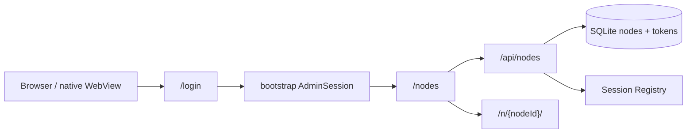

# Cloud Node Discovery

## 0. 术语约定

- **Relay Nodes Console**：客户端已经依赖的 `/nodes` 服务端控制台。官方公开实现从这里列出、打开、重命名和删除节点；它不是 `web/src/App.tsx` 的普通 Node UI。
- **Relay Login Page**：客户端遇到 Relay 账号未登录时进入的 `/login?next=...` 页面。自托管 V0 只接受现有 bootstrap 管理员用户名和密码，不复制官方邮箱验证码、OAuth 或注册功能。
- **Relay Node API**：客户端现有的 `GET /api/nodes`、`PATCH /api/nodes/{id}`、`DELETE /api/nodes/{id}` 契约。
- **Relay Auth API**：客户端现有的 `GET /api/auth/me`、`POST /api/auth/logout` 契约，以及自托管已有的 `POST /api/cloud/v1/auth/login` bootstrap 登录契约。
- **Relay Node Payload**：客户端读取的节点投影，包含 `id`、`name`、`status`、`last_seen_at` 和 `base_url`；不得包含 Device Token、device ID 或 connection ID。
- **Public Node Route**：已有 `/n/{nodeId}/...` 数据面入口；本 feature 只从节点控制台生成和打开该地址。

客户端契约证据：

- `web/src/App.tsx:808-836` 已按 `/n/{id}/` 生成节点 URL，并把 `id` / `display_name` 映射给移动端启动器。
- `web/src/components/Login.tsx:127-321` 已有本地启动器节点的打开、重命名、删除与同步交互，但该组件只在原生壳启动器 origin 渲染，不是网页 `/nodes`。
- `harmony/entry/src/main/ets/pages/Index.ets:690-725` 会从 `/nodes` DOM 中提取指向 `/n/` 的 anchor。
- 2026-08-04 对官方 `https://relay.a9gent.com` 的只读检查表明：`/nodes` 是独立 Relay 控制台；公开脚本调用 `GET /api/nodes`、`PATCH /api/nodes/{id}`、`DELETE /api/nodes/{id}`、`GET /api/auth/me` 和 `POST /api/auth/logout`。根路径 `GET /api/dirs` 与 `GET /api/relay/status` 均为 404，因此不能把 Node 内部 API 误当成 Relay 控制台 API。

## 1. 决策与约束

### 需求摘要

- **用户目标**：换浏览器、隐私模式或清理站点数据后，管理员仍能从 Cloud 找回已绑定节点，不需要记住 `/n/{nodeId}/`。
- **核心行为**：bootstrap 管理员通过 `/login` 登录，在 `/nodes` 查看服务端节点；在线节点可打开，节点可按客户端现有能力重命名或删除。
- **成功标准**：从全新浏览器访问 `/nodes`，只凭 bootstrap 管理员凭据即可完成登录、查看节点状态、打开在线节点、重命名节点和删除节点。
- **明确不做**：不做用户注册、邮箱验证码、OAuth、OIDC、多用户、tenant/ACL、节点共享、Token 轮换、分页、搜索；不修改 `server/`、`web/`、`cli/`、`android/`、`harmony/` 或根模块。

### 复杂度档位

走默认档位，偏离如下：

- **Compatibility = strict**：客户端公开行为是唯一协议来源；Cloud 不新增客户端必须认识的 API、字段、Header 或状态机。
- **Performance = reasonable**：V0 一次读取当前管理员的全部节点，不引入分页或缓存；在线状态从内存 Registry 合并。
- **Security = strict browser session**：节点目录与写操作必须有 bootstrap 管理员 Session；写操作使用同源 Origin 校验和 SameSite Cookie，不要求客户端不存在的 CSRF Header。
- **Observability = logged**：复用 method/status/duration 日志与 metrics，不记录节点名称、ID、列表内容或凭据。

### 关键决策

1. **协议只采用客户端已有 Relay 路由**：节点集合使用 `/api/nodes`，不新增 `/api/cloud/v1/nodes`；`/api/dirs` 仍是 Node 内部 managed roots API，不能在 Cloud 根路径复用为节点目录。
2. **`/nodes` 保持独立 Relay 控制台**：Cloud 继续服务独立 HTML，而不是把 `web/dist` 的完整 Node App 挂到 `/nodes`。普通浏览器加载 `web/dist` 会启动 `App` 并依赖 `/api/relay/status`、`/api/dirs` 等 Node API，不符合 Relay 控制台职责。
3. **V0 身份只复用现有 AdminSession**：不发明 `CloudPrincipal`、tenant 或第二种用户模型。`GET /api/auth/me` 由现有 admin Session 返回 bootstrap 管理员摘要；未来多用户若实现，再在认证层替换 Session 所属用户和节点过滤，不改变 Relay Nodes API。
4. **登录页面适配 bootstrap 凭据，路由保持客户端习惯**：`/login?next=...` 显示用户名/密码表单，调用现有 `POST /api/cloud/v1/auth/login`；成功后只允许回到同源 `/nodes` 或 `/n/{nodeId}/...`。不伪造官方邮箱/OAuth 接口。
5. **实现客户端现有节点能力而非只做列表**：V0 同时提供 list、rename、delete。这样后续多用户只需给相同 API 加可见性/所有权过滤，不需要重新设计节点控制台契约。
6. **SQLite 是节点事实来源，Registry 只提供在线快照**：持久化节点即使离线也出现在列表；`status` 由当前 Registry presence 投影为 `online` / `offline`。
7. **删除是节点撤销操作**：删除节点时事务性移除该节点及 Device Token，使后续 Connector 重连失败；同时关闭当前在线 Relay Session。
8. **Node URL 只由服务端 node ID 生成同源地址**：控制台使用 `/n/{id}/`，`base_url` 仅为兼容字段，不接受数据库中的任意外部 URL。

### 可卸载边界

移除 Relay Nodes Console 页面、Relay Nodes API 路由、Store 的 list/rename/delete 契约和节点删除时的 Registry 断连挂载后，本 feature 即从用户与系统视角消失；Binding、Connector、Gateway、SQLite schema 和 Public Node Route 继续工作。

## 2. 名词与编排

### 2.1 名词层

#### 现状

- `cloud/internal/store/contracts.go:39` 的 `Node` 已有 ID、名称、状态、创建时间和最近在线时间，但 `Store` 只暴露 `GetNode`。
- `cloud/internal/connector/registry.go:18` 的 `NodePresence` 已能表达当前在线连接。
- `cloud/app/browser_handlers.go:10` 的 `/nodes` 只读取 `mindfs_launcher_nodes` localStorage；`/login` 直接重定向，`/api/auth/me` 固定返回 `auth_required=false`。
- `cloud/app/binding_handlers.go:91` 已有 bootstrap 管理员登录、HttpOnly Session Cookie 和 `authenticateAdmin`。

#### 变化

**Relay Node Payload** 使用客户端已观察字段：

```json
[
  {
    "id": "node_123",
    "name": "home-pc",
    "status": "online",
    "last_seen_at": "2026-08-04T04:30:00Z",
    "base_url": "https://relay.example.com/n/node_123/"
  }
]
```

- `id`、`name` 必填。
- `status` 只返回 `online` 或 `offline`。
- `last_seen_at` 没有记录时为 `null`。
- `base_url` 为当前 Cloud origin 下的绝对 `/n/{id}/` 地址；客户端也可只用 `id` 自行生成。

**Relay Auth Me Payload** 保持客户端可消费的最小用户摘要：

```json
{
  "id": "usr_bootstrap",
  "name": "admin",
  "username": "admin",
  "roles": ["owner"]
}
```

该对象来自现有 AdminSession 和配置中的管理员用户名，不引入持久化用户表、tenant 或注册态。

**Rename Request**：

```http
PATCH /api/nodes/node_123
Content-Type: application/json

{"name":"office-pc"}
```

成功返回更新后的 Relay Node Payload；名称去除首尾空白后不能为空。

**Delete Request**：

```http
DELETE /api/nodes/node_123
```

成功返回 `{"success":true}`；节点、Device Token 和在线 session 均不可继续使用。

### 2.2 编排层



#### 现状

- 浏览器节点发现完全依赖当前浏览器 localStorage，Cloud 已保存的节点没有进入页面。
- bootstrap Session 只用于绑定确认，`/nodes` 与 `/api/auth/me` 未连接该 Session。
- Store 和 Registry 没有节点集合管理编排。

#### 变化

1. 访问 `/nodes` 时验证 AdminSession；未登录重定向到 `/login?next=/nodes`，已登录返回 Relay Nodes Console。
2. `/login` 使用现有 bootstrap 登录接口创建 Session；登录成功后按严格同源规则进入 `next`。
3. 控制台调用 `GET /api/auth/me` 展示当前 bootstrap 管理员，并调用 `GET /api/nodes` 周期刷新节点。
4. list 编排一次读取 SQLite 节点，逐项合并 Registry presence，生成同源 `base_url` 并确定性排序。
5. 在线节点可打开 `/n/{id}/`；离线节点保留可见但打开动作禁用，符合客户端当前 UI 行为。
6. rename 验证 Session、同源写请求和名称后更新 SQLite，再返回更新投影。
7. delete 验证 Session 与同源写请求后，先在事务中撤销节点和 Token，再关闭 Registry 中该节点的 active session，最终返回 success。
8. logout 清除 AdminSession Cookie 并返回 success；页面回到 `/login`。

#### 流程级约束

- `GET /api/auth/me`、`GET /api/nodes` 未登录统一返回 401 `{"error":"unauthorized"}`。
- `PATCH` / `DELETE /api/nodes/{id}` 未登录返回 401；跨源或来源不可信返回 403 `{"error":"forbidden"}`。
- 未找到节点返回 404 `{"error":"node_not_found"}`；空名称或非法 JSON 返回 400；Store 失败返回 500 `request_failed`。
- list 和 auth GET 无副作用；页面与认证/节点响应使用 `Cache-Control: no-store`。
- rename/delete 不要求自定义 CSRF Header，因为客户端没有发送；服务端必须校验同源 Origin，并依赖 Secure + HttpOnly + SameSite=Lax Session Cookie。
- delete 的持久化撤销先于 session 关闭。即使关闭 session 失败，旧 Token 也不能重连；错误需记录但不能回滚已完成的凭据撤销。
- 排序固定为 online 优先，再按最近在线时间倒序、创建时间倒序、Node ID 升序。
- 列表、错误和日志不得暴露 device ID、Token、Token hash、connection ID、CSRF hash 或管理员密码。
- `/n/{nodeId}/...` 的 Node 内部 HTTP、WebSocket、E2EE 与 `node_auth` 协议不在本 feature 改写。

### 2.3 挂载点清单

1. Relay 浏览器路由：`/nodes`、`/login`、`GET /api/auth/me`、`POST /api/auth/logout`。
2. Relay Nodes API：`GET /api/nodes`、`PATCH /api/nodes/{id}`、`DELETE /api/nodes/{id}`。
3. Store 节点集合管理契约：list、rename、delete-with-token-revocation。
4. Session Registry 单节点断连能力：删除节点后关闭 active Relay Session。

本 feature 不新增数据库表、配置键、定时任务、第三方登录或客户端改动。

### 2.4 推进策略

1. **认证与控制台骨架**：让 `/login`、`/nodes`、`/api/auth/me`、logout 复用现有 AdminSession，并完成安全 next 跳转。
   - 退出信号：未登录进入登录页，登录后进入节点页，me/logout 行为与客户端观察一致，现有绑定登录仍可用。
2. **客户端节点查询契约**：实现 `GET /api/nodes` 和 Relay Node Payload，接通 SQLite 集合读取与 Registry 在线状态。
   - 退出信号：空集合、多节点、online/offline、排序和错误语义均可观察。
3. **节点控制台接入**：页面按客户端现有交互展示状态、打开在线节点、定时刷新，并输出可被移动端识别的 `/n/` anchors。
   - 退出信号：全新浏览器登录后无需输入 Node URL 即可看到并打开在线节点。
4. **重命名能力**：实现 PATCH 契约、同源写保护和页面编辑交互。
   - 退出信号：合法名称持久化并刷新显示，空名称/不存在节点/跨源请求返回约定错误。
5. **删除与撤销能力**：实现 DELETE 契约、Token 撤销和在线 session 关闭。
   - 退出信号：节点从列表消失，旧 Connector 断开且旧 Token 无法重连，其他节点不受影响。
6. **兼容与范围回归**：验证浏览器、移动端 DOM 提取契约、绑定和 Public Node Route。
   - 退出信号：客户端相关场景有证据，`cloud/**` 外无代码 diff，未引入多用户或官方未要求的接口。

### 2.5 结构健康度与微重构

#### 评估

- 文件级 `cloud/app/browser_handlers.go`：当前 95 行但内嵌整页 HTML；新增登录、节点控制台和交互后会混合多个页面与 API 职责。
- 文件级 `cloud/app/binding_handlers.go`：209 行，已有 AdminSession 登录与认证 helper；继续加入节点 API 会形成第二项职责。
- 文件级 `cloud/internal/store/sqlite.go`：428 行，新增 list/rename/delete 仍属于 SQLite repository，但删除事务和测试会继续推高体积。
- 目录级 `cloud/app`：已有按 handler 责任拆文件的稳定模式，新增独立 nodes/auth browser handler 文件符合现状，无需重组目录。
- 目录级 `cloud/internal/store`：5 个同层文件，职责仍清楚，不需重组。
- compound 未命中目录组织、文件归属或命名 convention。

#### 结论：做微重构（拆文件）

在功能实现前，将现有 `browser_handlers.go` 中通用浏览器安全 Header 与安全 redirect helper 保留在浏览器公共文件，把 Relay 登录页、节点控制台页及其 handler 拆到独立职责文件。只移动现有行为与测试，不改变路由、响应或安全语义；以现有 browser handler tests 全绿作为退出信号，再开始 feature 主体。

SQLite repository 暂不拆分；其职责仍是单一持久化适配器。若后续多用户引入用户/节点关系查询，再单独走 `cs-refactor` 评估 repository 分组，不作为本 feature 前置。

## 3. 验收契约

### 关键场景清单

1. **未登录页面**：全新浏览器访问 `/nodes` → 跳到 `/login?next=/nodes`，页面不泄露节点数量、名称或 ID。
2. **bootstrap 登录**：提交正确管理员用户名/密码 → 设置现有 HttpOnly Session Cookie 并进入安全 next；错误凭据返回 401。
3. **安全 next**：外部 URL、协议相对 URL、反斜杠、非允许路径 → 登录后统一回到 `/nodes`。
4. **认证状态**：有效 Session 请求 `/api/auth/me` → 返回 bootstrap 管理员摘要；缺失/过期 Session → 401 `unauthorized`。
5. **登录后节点列表**：新浏览器登录 → `GET /api/nodes` 返回 SQLite 已绑定节点，无需输入 URL。
6. **空节点集合**：无节点 → 200 `[]`，页面显示绑定引导而非错误。
7. **在线状态与排序**：在线/离线节点并存 → status 和稳定顺序符合约定，周期刷新可反映连接变化。
8. **节点打开**：在线节点 → 打开当前 Cloud origin 的 `/n/{id}/`；离线节点 → 页面阻止打开并显示离线提示。
9. **移动端 DOM 契约**：节点页中每个节点都有规范 `/n/{id}/` anchor，名称为可读文本；不修改 Harmony/Android/Web 客户端。
10. **重命名**：同源已登录 PATCH 合法名称 → SQLite 更新且列表刷新；空名称 400，不存在节点 404。
11. **重命名防 CSRF**：跨源 PATCH → 403；客户端无需发送自定义 CSRF Header。
12. **删除节点**：同源已登录 DELETE → 节点和 Device Token 撤销、active session 关闭、列表移除。
13. **删除后重连**：已删除节点使用旧 Token 重连 → 认证失败；重新绑定产生新节点身份/Token。
14. **删除隔离**：删除一个节点 → 其他节点、Session 和 Token 不受影响。
15. **数据最小化**：节点 JSON → 只含约定字段，不含 device ID、Token、hash、connection ID 或管理员敏感信息。
16. **Store 失败**：list/rename/delete 存储失败 → 返回无敏感细节的 500，页面可重试且不展示陈旧成功状态。
17. **登出**：POST `/api/auth/logout` → 清除 Cookie，后续 me/nodes 返回 401，页面回到登录。
18. **绑定回归**：现有 `/bind` 登录、状态、确认和 CSRF 流程不变。
19. **Relay 回归**：已登录用户打开已知 `/n/{id}/` → 原 HTTP/WS/E2EE 链路不变。
20. **VPS 用户路径**：部署后清理站点数据访问 `/nodes` → 登录、查看、打开、重命名、删除均可在现有 VPS 手工验证。

### 明确不做的反向核对项

- 不应出现 `/api/cloud/v1/nodes`、`CloudPrincipal`、tenant、ACL、注册、邮箱验证码、OAuth 或 OIDC 实现。
- 不应在 Cloud 根路径实现 `/api/dirs` 或 `/api/relay/status` 作为节点控制台接口。
- 不应修改 SQLite schema 或新增用户/租户表。
- `server/`、`web/`、`cli/`、`android/`、`harmony/` 与根构建文件不应出现 diff。
- 不应实现节点共享、Token rotate、分页、搜索、WebSocket/SSE presence 推送或多实例状态聚合。

## 4. 与项目级架构文档的关系

Acceptance 阶段应更新 `.codestable/architecture/cloud-relay-core.md`：

- 增加 Admin Browser → Relay Auth → Relay Nodes API → SQLite/Registry → Public Node Route 的控制台流程。
- 将“没有节点管理”改为“提供客户端兼容的 list/rename/delete，不提供共享、Token 轮换和多用户权限”。
- 记录 `/api/nodes` 是 Relay 控制台契约，`/api/dirs` 是 Node 内部 managed roots 契约，二者不得混用。
- 记录 V0 只复用 bootstrap AdminSession，不引入虚构的 principal/tenant；未来用户体系应替换身份来源并为同一 Nodes API 增加可见性过滤。
- 记录节点删除会撤销 Device Token 并关闭 active Relay Session，而 Public Node Route 的 HTTP/WS/E2EE 转发协议保持不变。

`ARCHITECTURE.md` 已明确 Cloud 只适配客户端且上游只读，无需新增顶层子系统，只需补充 Relay 控制台属于 Cloud Relay 控制面。
