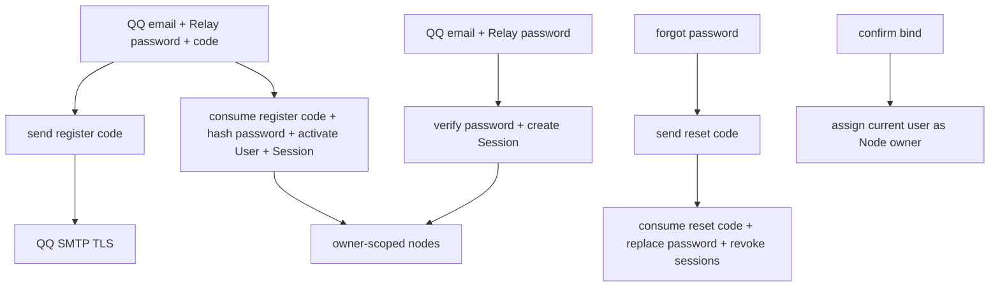

# Cloud Email Accounts

## 0. 术语约定

- **QQ 邮箱账号**：规范化后域名严格等于 `qq.com` 的邮箱地址。`vip.qq.com` 和其他域名不允许注册。
- **Relay 密码**：用户注册时为本 Relay 自己设置的密码。它不是 QQ 邮箱密码，Relay 永远不采集 QQ 邮箱密码。
- **注册验证码**：证明注册人能接收该 QQ 邮箱邮件的 6 位数字验证码，只用于注册。
- **重置验证码**：忘记 Relay 密码时发送的 6 位数字验证码，只用于重置密码；不能拿注册验证码重置密码，反之亦然。
- **Cloud User**：以唯一 QQ 邮箱标识的 Relay 用户，保存 Relay 密码强哈希，不含 tenant、角色或 OAuth 身份。
- **Cloud Session**：邮箱密码登录或注册完成后建立的浏览器会话；Cookie 保存随机 Token，数据库只保存 hash。
- **Node Owner**：确认绑定时的当前 Cloud User。节点列表、重命名和删除只允许 owner 操作。
- **Bootstrap User**：升级 V0 时承接既有节点的待认领 QQ 账号；该邮箱完成注册并设置 Relay 密码后激活。

兼容证据与边界：

- 未修改 MindFS 客户端只在认证失败时跳 `/login?next=...`，并通过 `/api/auth/me` 判断是否已登录；登录页面内部使用验证码还是密码不是客户端固定协议。
- `/nodes` 继续调用 `GET/PATCH/DELETE /api/nodes`，因此多用户只需替换身份来源并增加 owner 过滤，不修改客户端。
- 官方公开绑定页调用 `POST /api/bind/confirm {code,name}`；当前 V0 使用 `{code,action,node_name}`，本 feature 兼容两种请求体。

## 1. 决策与约束

### 需求摘要

- **用户目标**：用户只在注册或忘记密码时接收验证码，平时直接使用 QQ 邮箱和自己设置的 Relay 密码登录。
- **核心行为**：QQ 邮箱验证码注册、邮箱密码登录、退出、忘记密码、登录后修改密码、Session 管理、节点 owner 隔离和 V0 节点认领。
- **成功标准**：用户注册一次后可反复使用邮箱+Relay 密码登录；两个用户只能管理自己的节点；忘记密码可通过 QQ 邮箱验证码恢复账号。
- **明确不做**：不使用验证码进行日常登录；不采集 QQ 邮箱密码；不支持非 `@qq.com` 邮箱；不做 OAuth、OIDC、tenant、RBAC、节点共享、邀请码或上游客户端源码修改。

### 复杂度档位

- **Robustness = L3**：注册、密码验证、验证码消费、Session、迁移和 SMTP 都有明确错误与原子边界。
- **Structure = layers**：HTTP handler、Identity Service、Password Hasher、Mail Sender、Store 分层。
- **Performance = reasonable**：SQLite 单实例，不设外部 QPS 预算；密码哈希参数防止廉价爆破但不能拖垮服务。
- **Readability = team**：账号代码按职责拆分，错误语义和安全不变量直接可查。
- **Security = hardened**：按密码泄露、凭据填充、验证码爆破、重放、账号枚举、Session 劫持和节点越权设计。
- **Compatibility = cross-version**：保留客户端 `/login`、me/logout、nodes 和绑定导航契约，兼容 V0 绑定请求体。
- **Testability = verified**：密码、验证码、并发注册/重置、Session 撤销和 owner 隔离必须有自动化证据。

### 关键决策

1. **邮箱是登录账号，不另设用户名**：注册、登录、找回密码统一使用规范化 QQ 邮箱；页面展示名默认也是完整邮箱。
2. **注册三要素缺一不可**：注册提交 `email + Relay password + email code`。验证码正确但密码不合格不消费；创建 User、消费 code 和创建 Session 在同一事务完成。
3. **日常登录只用邮箱和 Relay 密码**：`POST /api/auth/login` 不接受 code，也不发送邮件。登录失败统一 `invalid_credentials`，不暴露邮箱是否注册。
4. **密码只存强哈希**：采用带随机 salt 和参数的 Argon2id PHC 编码字符串；不保存明文、可逆密文或 QQ 邮箱密码。密码要求 8-128 个字符，不强制大小写/符号组合。
5. **完整密码生命周期属于 V1 核心**：提供忘记密码和登录后修改密码。重置成功撤销该用户全部 Session；修改成功撤销其他 Session 并轮换当前 Session。
6. **验证码按 purpose 隔离**：`register` 和 `password_reset` 使用独立记录与 HMAC 上下文；10 分钟有效、60 秒重发、最多 5 次错误尝试、单次消费。
7. **仅采用 QQ 邮箱白名单**：非 `@qq.com` 地址在验证码记录和 SMTP 调用前返回 `email_not_allowed`。
8. **V0 节点通过注册认领**：迁移创建 `pending_verification` bootstrap User 并把既有节点归属它；只有该邮箱完成注册验证码验证并设置 Relay 密码后才能登录和管理既有节点。
9. **owner 只约束控制面**：绑定确认、list、rename、delete 按当前 user 过滤；Connector Token、`/n/{nodeId}`、HTTP/WS/E2EE 和 Node 自身认证保持 V0 行为。
10. **不保留公网 bootstrap 密码后门**：旧 `/api/cloud/v1/auth/login` 和 AdminSession 不再授权；旧管理员密码环境变量可继续存在但不被读取。

## 2. 名词与编排

### 2.1 名词层

#### 现状

- `cloud/internal/binding/auth.go` 使用固定管理员用户名/密码，`AdminSession` 没有 user ID。
- SQLite 没有 users、password hash、verification codes、user sessions 或 Node owner。
- 节点 list/rename/delete 是全局管理员视图。
- V0 登录页只有管理员用户名和密码；绑定确认不知道操作者身份。
- 配置不存在 QQ SMTP 或 bootstrap email。

#### 变化

**User**：

```text
User {
  ID: string
  Email: normalized @qq.com address
  PasswordHash: Argon2id PHC string or empty while pending verification
  Status: pending_verification | active | disabled
  CreatedAt: time
  PasswordChangedAt: optional time
  LastLoginAt: optional time
}
```

**Email Verification Code**：

```text
EmailVerificationCode {
  Email: normalized @qq.com address
  Purpose: register | password_reset
  CodeHash: HMAC(identity_key, purpose || email || code || nonce)
  SourceHash: HMAC(identity_key, observed source)
  ExpiresAt: time
  ResendAvailableAt: time
  AttemptsRemaining: 5..0
  CreatedAt: time
  ConsumedAt: optional time
}
```

**User Session**：保存 Session hash、user ID、有效期、创建和最近使用时间。密码变更或重置时可按 user ID 批量撤销。

**Node** 新增必填 `OwnerUserID`。Gateway 保留全局 `GetNode(nodeID)`；管理面使用 owner-scoped list/rename/delete。

**请求注册验证码**：

```http
POST /api/auth/register/request-code
Content-Type: application/json

{"email":"421690794@qq.com"}

200 {"resend_after_seconds":60}
403 {"error":"email_not_allowed"}
409 {"error":"email_taken"}
429 {"error":"email_code_rate_limited"}
503 {"error":"email_sender_not_configured"}
```

**注册**：

```http
POST /api/auth/register
Content-Type: application/json

{"email":"421690794@qq.com","password":"relay-password","code":"123456"}

200 {"user":{"id":"usr_xxx","email":"421690794@qq.com","name":"421690794@qq.com"}}
```

成功后设置 Session Cookie。active 邮箱返回 `email_taken`；pending bootstrap User 可被同邮箱注册激活。

**邮箱密码登录**：

```http
POST /api/auth/login
Content-Type: application/json

{"email":"421690794@qq.com","password":"relay-password"}

200 {"user":{"id":"usr_xxx","email":"421690794@qq.com","name":"421690794@qq.com"}}
401 {"error":"invalid_credentials"}
```

**忘记密码**：

```http
POST /api/auth/password/request-code
{"email":"421690794@qq.com"}

POST /api/auth/password/reset
{"email":"421690794@qq.com","code":"123456","new_password":"new-relay-password"}
```

request-code 对未注册 QQ 邮箱也返回同样 200，但不发送邮件，避免公开枚举账号；重置统一使用 `email_code_invalid` 表示不可用。

**登录后修改密码**：

```http
POST /api/auth/password/change
{"current_password":"old","new_password":"new"}
```

要求有效 Session 和正确当前密码；成功后撤销其他 Session、轮换当前 Session。

**配置文件**：

```dotenv
MINDFS_CLOUD_SMTP_HOST=smtp.qq.com
MINDFS_CLOUD_SMTP_PORT=465
MINDFS_CLOUD_SMTP_TLS=true
MINDFS_CLOUD_SMTP_FROM=421690794@qq.com
MINDFS_CLOUD_SMTP_USERNAME=421690794@qq.com
MINDFS_CLOUD_SMTP_PASSWORD=<QQ authorization code>

# optional; defaults to SMTP username
MINDFS_CLOUD_BOOTSTRAP_EMAIL=421690794@qq.com
```

真实值写在 VPS 的 `cloud/deploy/.env`，该文件 Git ignored、权限 `0600`，Compose 注入 Relay。SMTP 授权码不写数据库、不提交 Git、不提供配置页面或 Secret 查询 API。Identity Key 在数据目录自动生成并持久化。

### 2.2 编排层



#### 现状

- 固定 bootstrap 用户名/密码直接创建无 user identity 的 AdminSession。
- 绑定确认创建 Node/Token，但节点没有 owner。
- 所有节点管理操作共享一个全局视图。

#### 变化

1. 启动加载 QQ SMTP，自动加载/创建持久 Identity Key，并迁移 bootstrap pending User、Node owner 和新表。
2. 注册验证码入口只接受 `@qq.com`，检查邮箱/来源限流，保存 hash 后经 QQ SMTP 发送；发送失败撤销 code。
3. 注册事务验证 purpose=register 的 code 和密码规则；新建或激活 pending User，写 Argon2id hash，消费 code，创建 Session。
4. 登录按规范化邮箱读取 active User，恒定路径验证 password hash；成功更新 last login 并创建 Session，失败统一 401。
5. 忘记密码请求对外返回一致结果；仅 active User 实际收到 purpose=password_reset 的 code。reset 事务替换 password hash、消费 code 并撤销全部旧 Session。
6. 登录后修改密码先验证当前密码，写新 hash、撤销其他 Session，并为当前浏览器轮换 Session Token。
7. `/login` 页面提供“登录 / 注册”模式和“忘记密码”入口；不展示 OAuth、验证码登录或 QQ 邮箱密码字段。
8. `/api/auth/me` 返回当前 User；logout 删除当前 Session 并过期 Cookie。
9. 绑定确认把 current user ID 传入事务；官方 `{code,name}` 和 V0 请求体都受支持。
10. 节点 list/rename/delete 以 owner user ID 查询；越权统一 404，删除仍撤销 Token 并关闭 active session。

#### 流程级约束

- Relay 密码 8-128 个字符，原样处理、不 trim、不要求字符组合；永不记录、回显或通过邮件发送。
- Password hash 使用 Argon2id PHC 格式，参数集中配置在代码常量，验证时支持未来 rehash 升级。
- 登录按邮箱和请求来源限流；不存在邮箱和错误密码走相同响应及近似计算路径，降低枚举和时序差异。
- 验证码 6 位数字、10 分钟有效、60 秒重发、最多 5 次失败；注册和重置 code 不能跨 purpose 使用，并发消费只能成功一次。
- 同邮箱验证码每小时最多 10 次，同来源每小时最多 30 次；状态持久化，重启不清空。
- Session Token 至少 256 bit、12 小时 TTL；Cookie 为 HttpOnly、Secure、SameSite=Lax、Path=/。
- 注册/登录/重置成功后只允许跳转同源 `/nodes`、`/bind?...` 或 `/n/{id}/...`。
- owner 越权统一 `node_not_found`；普通日志不得记录完整邮箱、密码、验证码、SMTP 授权码或 Session。
- SMTP 使用 `smtp.qq.com:465` implicit TLS，校验证书和主机名，不允许降级明文。
- `/n/{nodeId}`、Connector、HTTP/WS/E2EE 不新增 Cloud Session 门禁。

### 2.3 挂载点清单

1. Auth 路由与页面：register code/register、password login、me/logout、password reset/change、`/login`。
2. SMTP/Identity：VPS `.env` SMTP 配置、可选 bootstrap email、数据目录 Identity Key。
3. SQLite：users、verification codes、user sessions、rate-limit state、nodes/bind challenges owner 字段。
4. Binding：确认请求接入 current User，并兼容官方与 V0 请求体。
5. Nodes API：list/rename/delete 改为 owner-scoped 操作。

### 2.4 推进策略

1. **Store 微重构**：把 500 行 SQLite repository 按 binding、nodes、sessions 纯移动拆分。
   - 退出信号：现有测试全绿，对外接口和行为零变化。
2. **账号名词层**：加入 User、密码哈希、验证码、Session、Identity Key 和 SMTP 契约。
   - 退出信号：密码 hash/verify、Key 持久化、SMTP 配置与 Secret 清洗测试通过。
3. **注册与密码生命周期**：实现注册发码/注册、密码登录、忘记/重置/修改密码和限流状态机。
   - 退出信号：正常、边界、爆破、重放、并发、枚举防护和 Session 撤销测试通过。
4. **浏览器认证接入**：实现登录/注册/忘记密码页面和 me/logout/safe-next。
   - 退出信号：用户只在注册/重置时收验证码，后续可直接邮箱密码登录。
5. **Node owner 与迁移**：迁移 V0 节点、注册认领 bootstrap、绑定写 owner、管理按 owner 过滤。
   - 退出信号：双用户隔离、越权 404、V0 认领、Connector/Gateway 回归通过。
6. **部署与全量验证**：Compose 注入 VPS `.env`，补齐测试、文档和安全 review。
   - 退出信号：`go test ./...`、SQLite 升级演练和 fake SMTP 端到端全绿，Git 无真实授权码。

### 2.5 结构健康度与微重构

#### 评估

- `cloud/internal/store/sqlite.go` 已 500 行并混合 challenge、node、token、session；继续添加账号表会显著恶化，必须先按领域拆文件。
- `cloud/app/relay_browser_handlers.go` 152 行且含整页 HTML；页面模板可保留，认证 API 新建独立 handler 文件。
- `cloud/internal/config/config.go` 266 行，SMTP 仍属配置职责，用解析 helper 控制复杂度即可。
- `cloud/internal` 适合新增 identity 领域包；store 目录拆文件后仍未达到重组目录阈值。
- compound 未命中目录组织 convention。

#### 结论：微重构（拆文件）

- 从 `sqlite.go` 原样搬出 binding/token、nodes、sessions 方法到 `sqlite_binding.go`、`sqlite_nodes.go`、`sqlite_sessions.go`。
- 连接、schema 和公共扫描/时间 helper 留在 `sqlite.go`。
- 移动后立即运行 store/app/compat 测试，确认 SQL、错误和外部行为零变化，再开始账号功能。

## 3. 验收契约

### 关键场景清单

1. 合法 QQ 邮箱请求注册码 → 收到 6 位验证码；数据库、日志和响应无明文 code。
2. 非 `@qq.com`、`vip.qq.com`、畸形地址 → 发信前 403，MailSender 零调用。
3. 注册提交正确邮箱、合格 Relay 密码和 register code → active User + Session；之后邮箱密码可重复登录，无需验证码。
4. 注册密码不足 8、超过 128 或 code 错误/过期/已消费 → 不创建/激活账号，code 的消费语义符合事务约束。
5. active 邮箱再次注册 → `email_taken`；pending bootstrap 邮箱注册 → 激活原 User ID 并保留既有 Node owner。
6. 正确邮箱密码登录 → 创建 Session；错误密码、未注册、pending、disabled → 统一 `invalid_credentials`。
7. 数据库只保存 Argon2id PHC hash；源码、日志、邮件、HTTP 和备份检查中无明文 Relay 密码。
8. 注册和重置验证码不能互用；错误 5 次、过期、消费或并发重放只有规定结果。
9. 验证码冷却和小时限流在重启后继续有效；SMTP 失败不留下可消费 code。
10. 未注册 QQ 邮箱请求重置码 → 对外仍 200 但不发邮件；active 用户收到 reset code。
11. 正确 reset code + 新密码 → 密码更新，全部旧 Session 失效，新密码可登录，旧密码失败。
12. 登录后正确当前密码修改 → 新密码生效，其他 Session 失效，当前 Session 被安全轮换。
13. `/api/auth/me` 对有效 UserSession 返回邮箱摘要；旧 AdminSession、过期或撤销 Session 返回 401。
14. logout 删除服务端 Session 并清 Cookie，旧 Cookie 不能复用。
15. 登录页包含登录、注册、忘记密码；不含验证码日常登录、OAuth、用户名或 QQ 邮箱密码输入。
16. 用户 A/B 分别绑定节点 → 各自 nodes 只显示自己；官方和 V0 绑定请求体都正确写 owner。
17. B 修改/删除 A 的 node ID → 404 且 A 的节点、Token、Session 不变；A 删除自己的节点保持 V0 撤销语义。
18. V0 数据库升级 → bootstrap pending User 承接全部既有节点；其邮箱注册后节点完整可见。
19. Gateway、Connector、HTTP/WS/E2EE、assets、backup、health/metrics 无行为回归。
20. VPS `.env` 保存 QQ SMTP 授权码并被 Git 忽略；数据库、tracked files、日志和 HTTP 均不含授权码。

### 明确不做的反向核对项

- 不应存在验证码日常登录或 `POST /api/auth/login {email,code}`。
- 不应出现 QQ 邮箱密码字段、OAuth/OIDC route、tenant/RBAC/share/invitation 表或注册用户名。
- 非 `@qq.com` 不得调用 MailSender。
- Gateway/Connector 不得依赖 UserSession。
- 不修改上游只读路径和已暂停的 local-service draft。

## 4. 与项目级架构文档的关系

Acceptance 更新 `cloud-relay-core.md`：

- 单 bootstrap AdminSession 改为 QQ 验证码注册、Argon2id 密码登录、UserSession 和密码恢复流程。
- 数据状态加入 users、purpose-scoped verification codes、user sessions、Node owner 和 bootstrap pending-user migration。
- 记录 SMTP/Identity Key/Password Hash 的秘密边界以及 owner 只作用于控制面。
- 更新 Identity、Store、browser handler 和部署配置代码锚点。

Requirement 在 acceptance 时补充“注册一次，后续邮箱密码登录”和多用户节点隔离用户故事；design 阶段不提前把计划写成现状。
