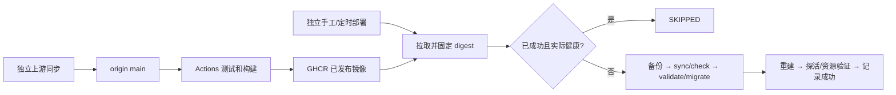

# Relay 镜像发布与独立部署

## 0. 术语与审批

- 上游同步：合并 upstream 后推送 origin；不部署。
- 发布镜像：Actions 为 main 构建 SHA 标签，并将仍为 main 当前提交的成功镜像发布到 latest。
- 目标 digest：本次部署固定的不可变 registry 引用；本地 image ID 用于与容器 `.Image` 比较，二者不混用。
- 成功版本：所有升级后验证通过才原子记录的 digest；不是 Git HEAD，也不是最近拉取的标签。
- 2026-09-07 用户通过 ExitPlanMode 批准完整计划，并另行批准缺失工作区门禁工具的人工豁免（见 worktree-override.md）。本文为该计划的项目内归档，不新增产品选择。

## 1. 目标与边界

提交 fork main 后由 Actions 发布镜像；服务器部署继续独立手动或由已有调度器调用。源码同步、发布和部署之间不等待、不调用对方，部署只消费已经发布的镜像。

明确不做：SSH/Webhook 自动触发、安装 cron、初装编排、数据库自动回滚、清卷、修改 Cloud 协议或客户端、修改既有未提交 app 工作、提交或 push 本轮改动。默认单实例/Linux/Compose 档位，不建立部署平台。

约束来源：requirements/mindfs-compatible-cloud-backend.md:32-38；architecture/cloud-relay-core.md:146-154。复用在线备份、幂等迁移、只增不删历史资源；生产凭据不入镜像或日志。Go 工具链最低 1.26.6。基线 `go -C cloud test ./deploy` 已通过。

Top 3 风险：误换项目/卷（升级前核对实际标签和挂载）；失败后错误跳过（成功标记最后写入并校验运行状态）；迁移/资源外部依赖（先备份、检查失败即停、不承诺无损回滚）。GHCR 私有包登录、Linux flock、Python 3 标准库、Compose V2 2.29.7+ 与 GitHub Releases 可用是部署前提；本轮只验证离线行为。

## 2. 设计

### 2.1 名词层：现状 → 变化

现状：auto-upgrade.sh:13-18 以 upstream 提交数决定升级，33 push、48 build；1Panel Compose:1-4 共享 build，但未共享镜像标签。

变化：生产 anchor 使用 `${RELAY_IMAGE:-ghcr.io/zhuxian89/mindfs-relay:latest}`。发布入口使用 `<完整 SHA>` 和 latest；部署拉取后固定 digest。例：成功记录为 D1、最新发布仍 D1 且容器健康则 SKIPPED；D2 升级失败不覆盖 D1，下一次仍尝试 D2。

本地 `.relay-upgrade/` 保存互斥锁、成功版本与临时验证材料，Git 忽略。调用者只需执行对应脚本，不直接操纵状态；现网配置和卷身份不符时拒绝升级。

### 2.2 编排层：现状 → 变化

现状是一个脚本同步源码、发布 Git、构建和部署。变化是独立上游同步入口与镜像消费入口。同步前保护 main、工作区和未完成 Git 操作；origin 只快进，upstream 可合并，仅中止本次冲突；前次 push 失败必须能重试。

部署检查现有容器 project/service 标签和实际 named volumes，保持原项目。拉取后确认不可变 digest 在本地存在；refresh-assets.sh 继承同一 COMPOSE_FILE/COMPOSE_PROJECT_NAME/RELAY_IMAGE。run 使用缓存的 digest（Compose 2.29.7 不支持 run --pull），up 使用 --no-deps --no-build --pull never --wait。成功标记、实际 image ID 和健康状态一致才跳过；失败不记录成功。两个维护入口共用同一 checkout 的 flock，锁竞争安全跳过。

### 2.3 挂载点

- `.github/workflows/build-relay.yml`：main 镜像发布。
- `cloud/deploy/docker-compose.1panel.yml`：生产镜像配置。
- `cloud/deploy/sync-upstream.sh`：独立源码同步命令。
- `cloud/deploy/auto-upgrade.sh` 与既有 cron wrapper：独立部署命令。

### 2.4 推进策略

按 checklist：发布配置 → 同步入口 → 镜像部署入口 → 运维交付与回归。每步以针对性测试/静态检查作为退出信号；最终独立 diff review。测试采用已有 refresh_assets_test.go 的离线命令桩模式，不访问生产。Linux CI 验证真实 flock 竞争，macOS 注入替身。

### 2.5 结构健康度

已有脚本 76/7 行、Compose 50 行，目录归属清楚；检索未发现冲突 convention。本次不做微重构。新职责各自一个脚本，测试按同步/部署分文件；不创建万能 helpers 或部署框架。

## 3. 验收契约

| 场景 | 可观察结果 | Step / 证据 |
|---|---|---|
| main 发布成功；旧 SHA 重跑 | SHA 镜像可定位，只有 main 当前 SHA 更新 latest | S1 / workflow 静态测试；真实发布待授权 |
| 默认本地构建/生产镜像 | 默认 Compose 保留 build，生产两个服务共享 image | S1 / Compose config、Go 测试 |
| 上游冲突/已有 Git 操作/脏工作区 | 停止且不破坏既有工作；前次 push 失败可重试 | S2 / 临时本地 Git 仓库测试 |
| 无新镜像或 CI 尚未完成 | 只看已发布镜像，不部署未发布源码 | S3 / 命令桩 |
| 升级成功 | 同一 digest 执行完整流程，最后原子写成功版本 | S3 / 命令桩 |
| 任一阶段失败 | 非零退出，不写成功记录，下次仍可重试 | S3 / 故障注入 |
| 项目/卷不匹配或任务重叠 | 不执行破坏性操作，不换卷 | S3 / 故障注入与锁竞争 |
| cron 失败输出含 SKIPPED | 不吞掉非零退出和错误输出 | S3 / wrapper 测试 |
| 无越界改动/未执行生产 | app 指纹不变；无 SSH、cron 安装、down -v | S4 / diff 与操作记录 |

DoD：Design/Implementation 按本稿；Review 独立审查并清除本轮 blocking；QA 运行 `go -C cloud test ./deploy`、`go -C cloud test ./...`、`bash -n`、合成 Compose config、`git diff --check`；Acceptance 如实区分离线通过和真实 Actions/生产验证未执行。无 UI 变化，无浏览器验证；部署状态日志属于功能，不新增调试输出或临时 TODO。

## 4. 交付与残余风险

交付 workflow、生产 Compose、两个独立维护入口及 wrapper、状态忽略规则、离线测试、README 与架构部署段落。完整 approved plan 位于会话计划文件；不触碰其他 feature。

真正的多架构构建/注册表发布、服务器凭据及生产升级需后续授权。GHCR 默认私有时由操作者预先配置只读拉取凭据；文档同时覆盖公开包。服务器需保留原项目/卷，首次启用前人工核验；迁移已写库时仅回退镜像不等于恢复数据库。

2026-09-07 实现备注：用 Python 3 标准库解析 Compose/Docker JSON 并核对卷身份，避免解析 YAML 文本和输出配置凭据。实现后单独进行了主代理 diff 复核；当前会话未启动独立 reviewer，因此该复核不冒充独立代理审查，正式独立审查和用户 review 保留在后续验收阶段。本轮不写 acceptance 报告。
